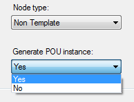

# Call Conveyor in Your Program

## Overview

You must call the conveyor in your project.

## PacDrive 3 Template

| Step | Action |
| --- | --- |
| 1 | Copy the code snippets of the Code snippets tab (refer to [Explorer](D-SE-0098004.html#D-SE-0098004__D-SE-0098004.3)) to the desired location in your application code. |
| 2 | If you are using PacDrive 3 Template, it is typically inside SubModules\_Action (of SR\_MainMachine or equivalent in a node module) which typically uses the FBD language.  To use the code snippets of Configuration Data, you can use the EXECUTE box to add code in structured text. |
| 3 | Add the in/out variables specific to your application. The variables used are only an example. |

## Non Template

| Step | Action |
| --- | --- |
| 1 | Copy the code snippets of the Code snippets tab (refer to [Explorer](D-SE-0098004.html#D-SE-0098004__D-SE-0098004.3)) to the desired location in your application code. |

NOTE: The Add Conveyor dialog box for Non Template conveyor type objects provides the option Generate POU instance.

If you select Yes for this option, the program call and the corresponding task call are generated by the system. Refer to [Code Generation Option for Non-Template Conveyors](D-SE-0097892.html#D-SE-0097892).

EIO0000003869.05