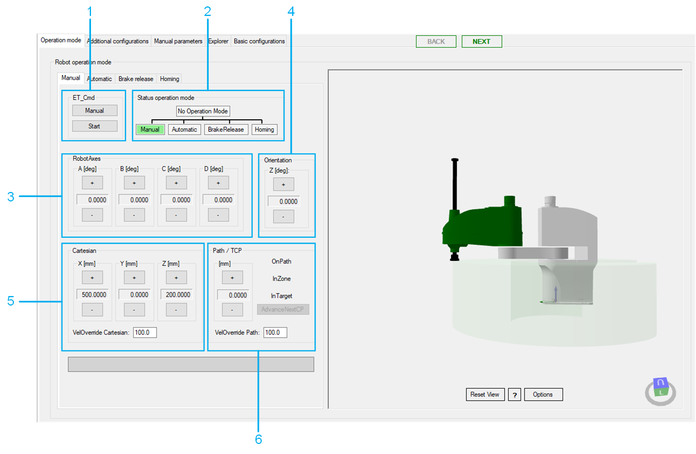
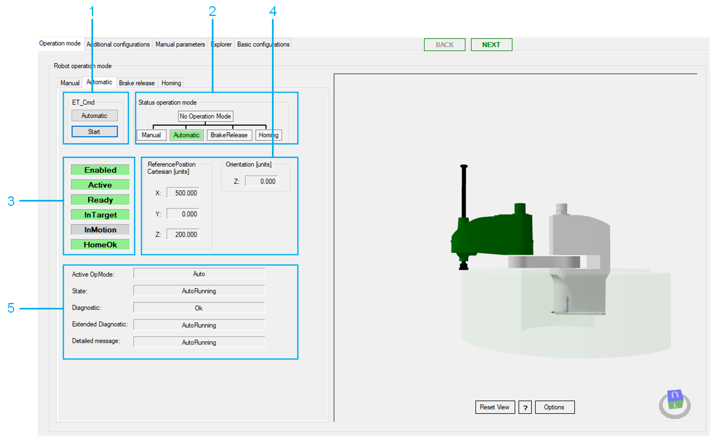
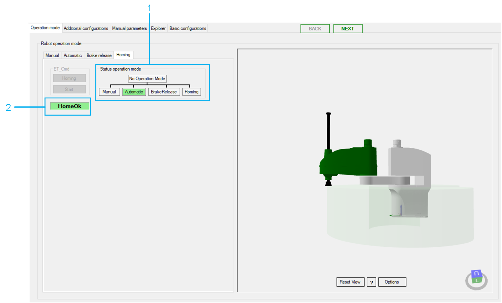

# Operation Mode

## Overview

Refer to the [Smart Template Modules User Guide](../../../../../api/crossBook?lang=en-US&virtualBookName=SmrtTplt&topicID=D_SE_0091270) for more information on displaying the different tabs.

The Operation mode tab provides a tab for each operation mode on the left-hand side:

* Manual
* Automatic
* Brake release
* Homing

On the right-hand side, the Operation mode tab displays a 3D visualization of the robot.

## Manual Tab

The Manual tab helps you to move the robot manually.

| WARNING | |
| --- | --- |
|  | UNINTENDED MOVEMENT OF THE AXIS  * Ensure the proper functioning of the functional safety equipment before commissioning. * Ensure that you can stop axis movements at any time using functional safety equipment (limit switch, emergency stop).  Failure to follow these instructions can result in death, serious injury, or equipment damage. |

NOTE: If the robot application is offline or the robot module is not called within the application, the controls of the Manual tab are disabled.

Moving the robot manually:

| Item | Description |
| --- | --- |
| 1 | ET\_Cmd  If the module is not in the operation mode Manual, click the Manual button to send the command RM.ET\_Cmd.Manual, and then click the Start button to send the command RM.ET\_Cmd.Start.  NOTE: Alternatively, you can send the commands with the variable iq\_stRobotModuleInterface.  If the Manual operation mode is accepted, the background color of the button becomes green under Status operation mode. |
| 2 | Status operation mode  Displays the operation mode of the module.  If the robot is in Manual operation mode, you can move the robot step by step with the buttons of the various jogging modes:   * Jogging along the cartesian coordinate system (Cartesian) * TCP (Tool Center Point) jogging on path (Path / TCP) * Jogging along the robot axes by controlling the corresponding drives (RobotAxes) * Jogging the orientation around cartesian Z of the coordinate system (Orientation) |
| 3 | RobotAxes  Click the buttons (+ / -) to jog along the robot axes by controlling the corresponding drives. |
| 4 | Orientation  Click the buttons (+ / -) to jog the orientation around cartesian Z of the coordinate system. |
| 5 | Cartesian  Click the buttons (+ / -) to jog the TCP (Tool Center Point) along the axes of the cartesian coordinate system.  VelOverride Cartesian: Proportional influence of the active cartesian jogging velocity. Unit: % |
| 6 | Path / TCP  Click the buttons (+ / - ) to jog the TCP (Tool Center Point) along a connected path (if a connected path is available).  For status information on the TCP movement, refer to the feedback properties [xOnPath](../../../../../api/crossBook?lang=en-US&virtualBookName=PD.Lib.Robotic&topicID=D_SE_0075539)xInZone, and xInTarget (refer to Robotic Library Guide).  VelOverride Path: Proportional influence of the active path jogging velocity. Unit: %. |

## Automatic Tab

The Automatic tab provides feedback and diagnostic information on the robot.

| Item | Description |
| --- | --- |
| 1 | ET\_Cmd  If the module is not in the operation mode Automatic, click the Automatic button to send the command RM.ET\_Cmd.Auto, and then click the Start button to send the command RM.ET\_Cmd.Start.  NOTE: Alternatively you can send the commands with the [ModuleInterface](SR_SCARA-ModuleInterface-2C27C2AF.html) (for example, iq\_etCmd).  If the Automatic operation mode is accepted, the background color of the operation mode status Automatic switches to green. |
| 2 | Status operation mode  Displays the operation mode of the module. |
| 3 | Feedback  A green background color indicates that the corresponding value is TRUE.   * Enabled  Module is enabled. * Active  More information can be found under: [ST\_ModuleInterface.q\_xRobotActive](../../../../../api/crossBook?lang=en-US&virtualBookName=PD.Lib.RoboticModule&topicID=D_SE_0076969). * Ready  More information can be found under: [ST\_ModuleInterface.q\_xRobotReady](../../../../../api/crossBook?lang=en-US&virtualBookName=PD.Lib.RoboticModule&topicID=D_SE_0076969) . * InTarget  More information can be found under: [IF\_RobotFeedback.xInTarget](../../../../../api/crossBook?lang=en-US&virtualBookName=PD.Lib.Robotic&topicID=D_SE_0075539). * InMotion  More information can be found under: [IF\_RobotFeedback.xInMotion](../../../../../api/crossBook?lang=en-US&virtualBookName=PD.Lib.Robotic&topicID=D_SE_0075539) . * HomeOk  More information can be found under: [ST\_ModuleInterface.q\_xHomeOk](../../../../../api/crossBook?lang=en-US&virtualBookName=PD.Lib.RoboticModule&topicID=D_SE_0076969). |
| 4 | ReferencePosition Cartesian and Orientation  More information can be found under: [IF\_RobotFeedback.rstRefPositionTCP](../../../../../api/crossBook?lang=en-US&virtualBookName=PD.Lib.Robotic&topicID=D_SE_0075539). |
| 5 | Diagnostic  Diagnostics of the robot module. More information can be found under: [ET\_DiagExt](../../../../../api/crossBook?lang=en-US&virtualBookName=PD.Lib.RoboticModule&topicID=D_SE_0076888). |

## Brake Release Tab

NOTE: The Brake release is not supported for the Lexium SCARA Robot.

## Homing Tab

The Homing tab displays the homing mode of the robot axes.

NOTE: For the Lexium SCARA Robot, the Homing command cannot be executed.

| Item | Description |
| --- | --- |
| 1 | Status Operation Mode  Displays the operation mode of the module. |
| 2 | HomeOk  More information can be found under: [ST\_ModuleInterface.q\_xHomeOk](../../../../../api/crossBook?lang=en-US&virtualBookName=PD.Lib.RoboticModule&topicID=D_SE_0076969). |

EIO0000005573.01