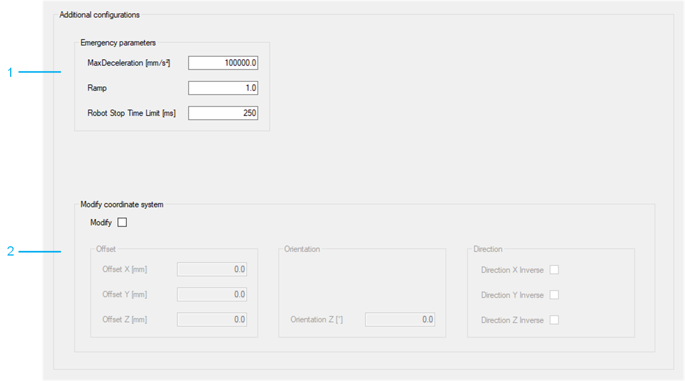

# Additional Configurations

## Overview

| Item | Description |
| --- | --- |
| 1 | Emergency parameters  The necessary data for an emergency stop must be configured.  More information can be found under: [SetEmergencyParameter](../../../../../api/crossBook?lang=en-US&virtualBookName=PD.Lib.RoboticModule&topicID=D_SE_0076929). |
| 2 | Modify coordinate system  The robot coordinate system can be modified. If the check box Modify is not selected, the coordinate system is set to default values defined by the selected robot.  More information can be found under: [ModifyCoordinateSystem](../../../../../api/crossBook?lang=en-US&virtualBookName=PD.Lib.RoboticModule&topicID=D_SE_0076937). |

EIO0000005573.01