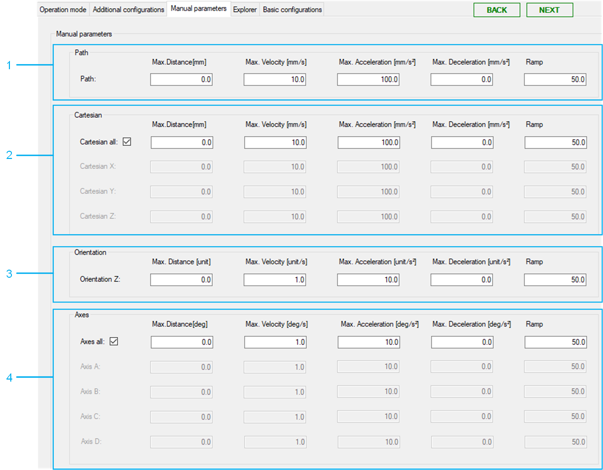

# Manual Parameters

## Overview

| Item | Description |
| --- | --- |
| 1 | Path: Initial parameter for jogging along the robot path.  More information can be found under: [SetParameter](../../../../../api/crossBook?lang=en-US&virtualBookName=PD.Lib.RoboticModule&topicID=D_SE_0076961). |
| 2 | Cartesian: Initial parameter for jogging the TCP (Tool Center Point) along its cartesian axis.  The displayed cartesian parameters depend on the configured working plane.  More information can be found under: [SetParameter](../../../../../api/crossBook?lang=en-US&virtualBookName=PD.Lib.RoboticModule&topicID=D_SE_0076961). |
| 3 | Orientation: Initial parameter for the rotational component Z of the orientation.  More information can be found under: [SetParameter](../../../../../api/crossBook?lang=en-US&virtualBookName=PD.Lib.RoboticModule&topicID=D_SE_0076961). |
| 4 | Axes: Direct control (jogging) of the motors of the robot.  More information can be found under: [SetParameter](../../../../../api/crossBook?lang=en-US&virtualBookName=PD.Lib.RoboticModule&topicID=D_SE_0076961). |

EIO0000005573.01