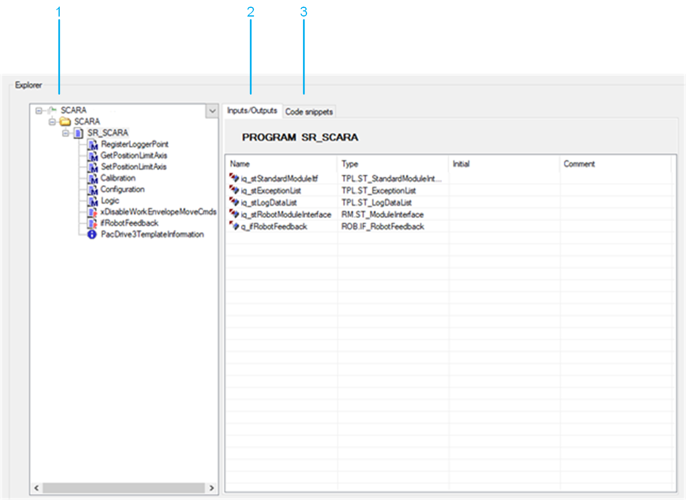
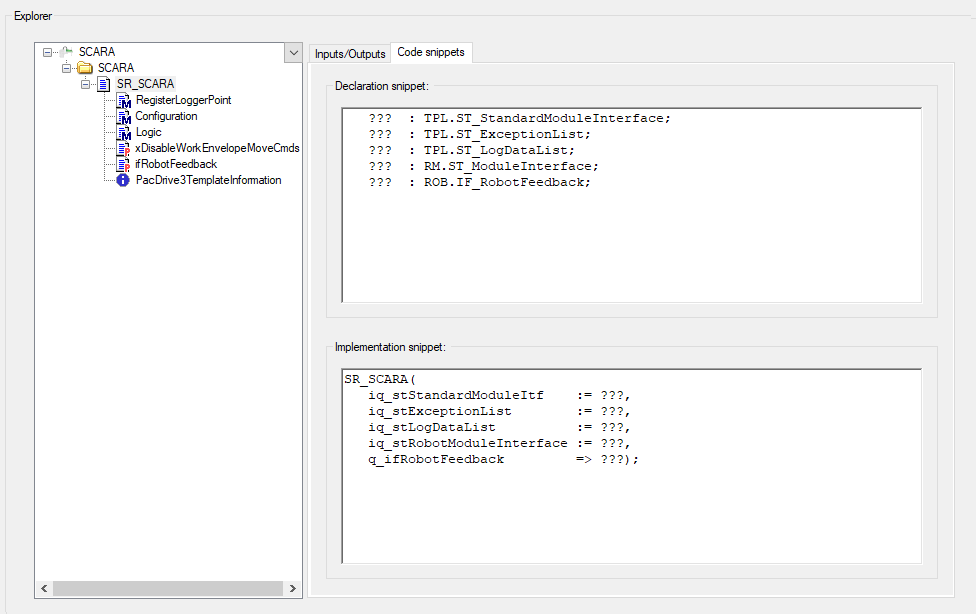

# Explorer

## Overview

The Explorer displays the software structure of the robot object.

| Item | Description |
| --- | --- |
| 1 | Overview of the available interfaces of the robot. |
| 2 | Inputs/Outputs: Detailed interface of the selected item. |
| 3 | Code snippets: Copy the code snippets of this tab to the desired location in your application code. |

EIO0000005573.01