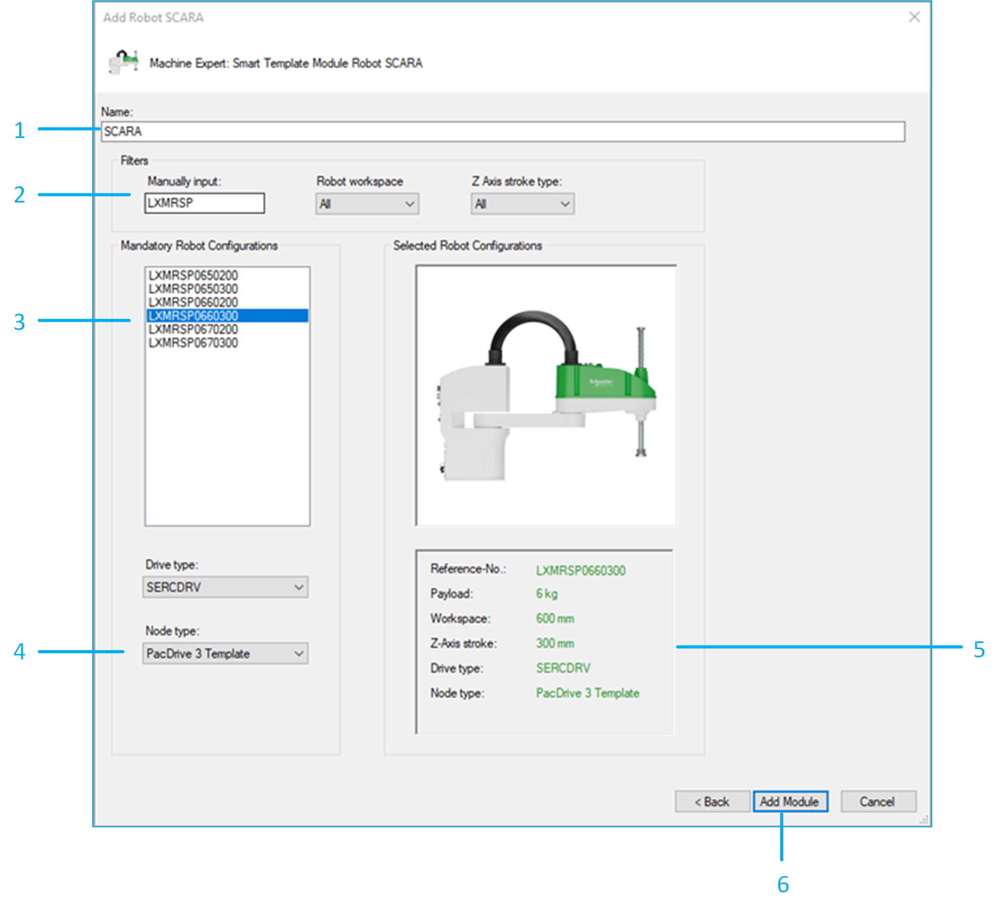

# Adding the Lexium SCARA Robot

| Step | Action |
| --- | --- |
| 1 | Enter a Name for the robot. The created object and the created drives use this name. |
| 2 | Use the Filters to filter the list of robot types:   * Manually input: Enter the reference number (for example LXMRSP066) * Robot workspace: From the drop-down list, select 500 mm, 600 mm, 700 mm or All. * Z Axis stroke type: From the drop-down list, select 200 mm, 300 mm or All. |
| 3 | Select the reference number of the robot you want to add. |
| 4 | Select the Node type:  * PacDrive 3 Template: The generated robot is prepared to be used with the PacDrive 3 Template * Non Template: The generated robot can be used in other EcoStruxure Machine Expert software architectures without PacDrive 3 Template |
| 5 | Verify the robot configuration. You cannot modify the configuration after leaving this dialog box. |
| 6 | Use the Add Module button to add the configured robot to your project. |

EIO0000005573.01