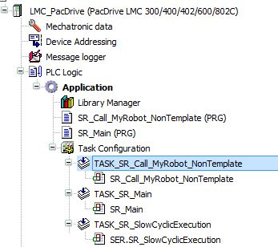
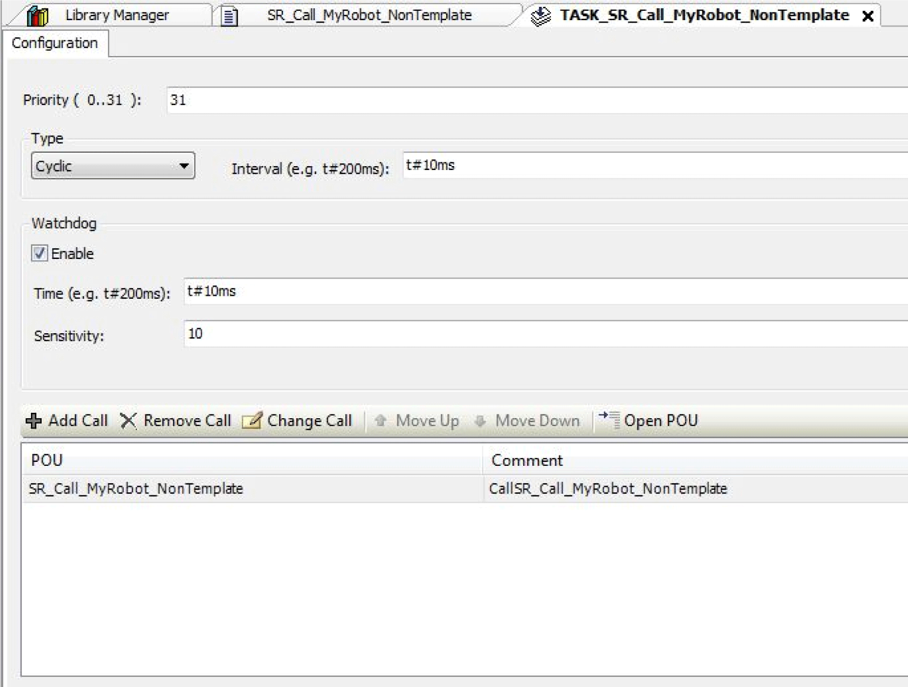
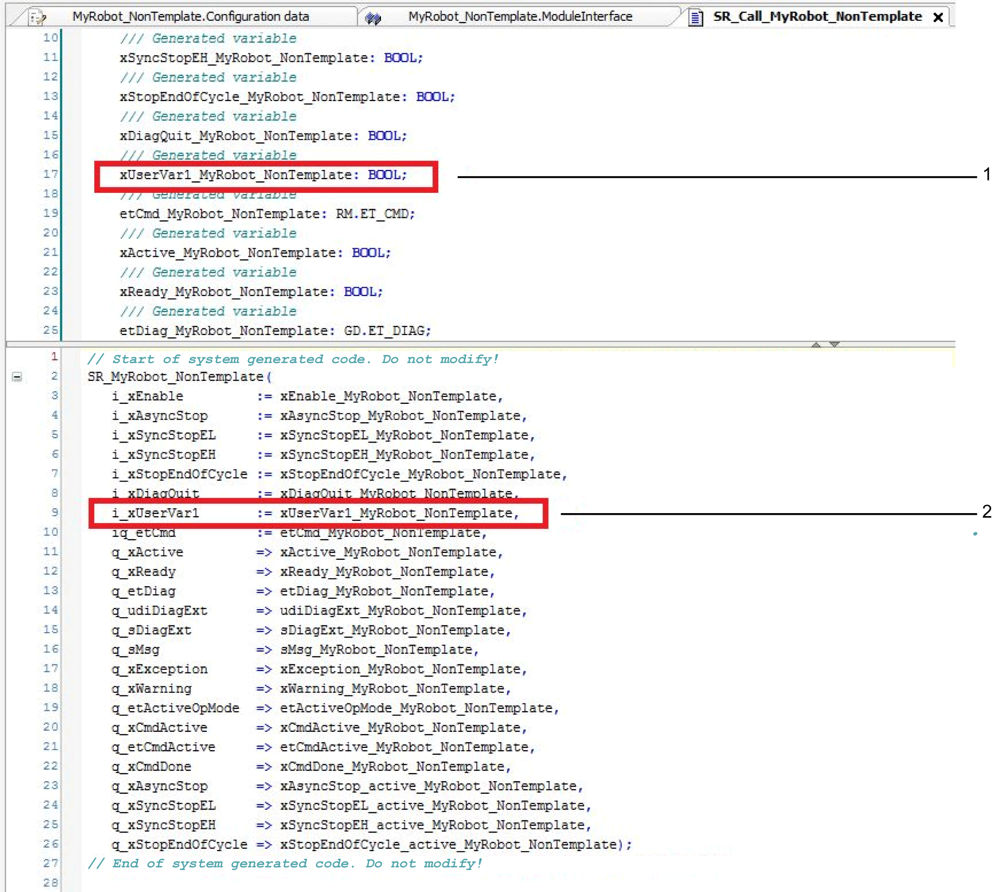
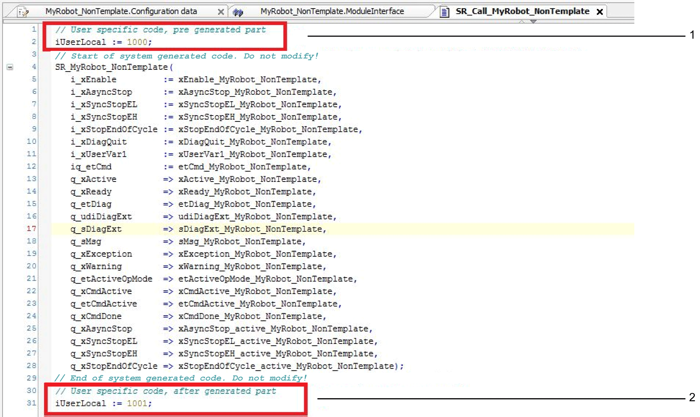
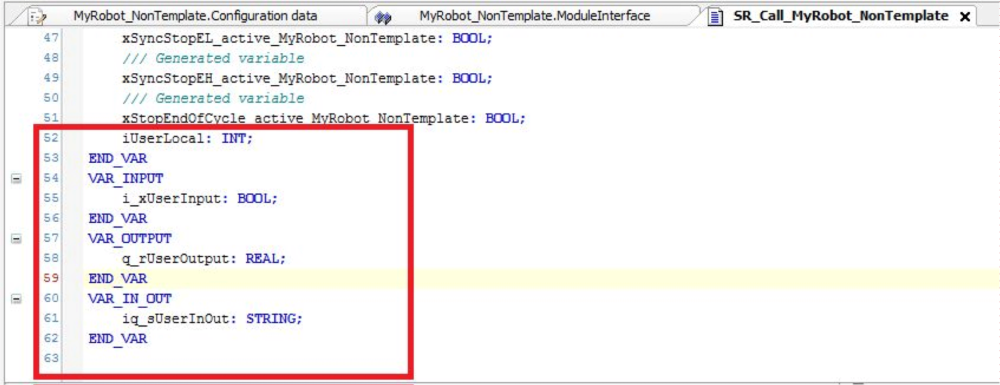
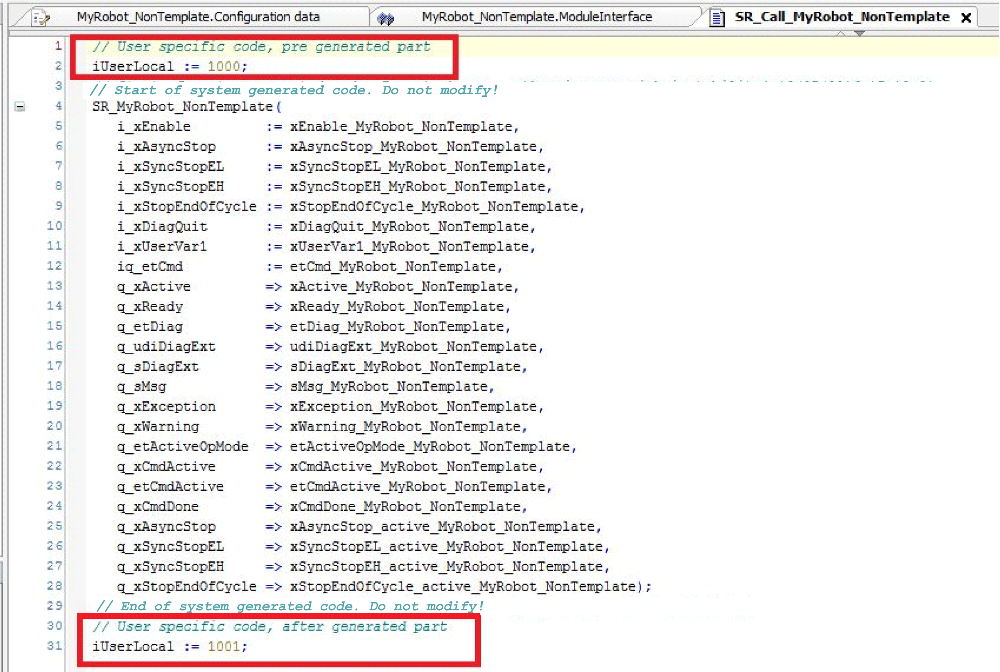

# Code Generation Option for Non Template Robots

## Generate POU Instance Option

With the Add Robot SCARA dialog box, you can create a program and call the robot instance and its corresponding task automatically.

Adding a new Non Template robot node with code generation:

| Step | Action |
| --- | --- |
| 1 | For Node type, select Non Template. |
| 2 | For Generate POU instance, select Yes. |

## Generated POUs

If you select Yes for the Generate POU instance option, the three following elements are added to your project:

* A call program SR\_Call\_<Robot Name> is added to your project.

  
* A corresponding task TASK\_SR\_Call\_<Robot Name> is added to your project.

  
* The POU call of the call program SR\_Call\_<Robot Name> within the task is added to your project.

  

After the automatic generation procedure by the system, the project can be built and downloaded to the controller.

NOTE: Once a robot node has been added to the Module structure, the node type cannot be modified. For further information about using the code generation option, refer to [Call Robot in Your Program](CallRobotInYourProgram-2C238DE1.html).

## Trigger for Program Call Regeneration

For details on data exchange, refer to [Data Exchange](DataExchangeWithModuleInterface-2C292ECA.html).

If you added or deleted variables within the Module Interface dialog box and then opened the Configuration data object under <Robot Name>, the call program SR\_Call\_<Robot Name> is regenerated with the modified Module Interface variables.

The regeneration procedure implies the following for the program SR\_Call\_<Robot Name>:

* Variable declaration is adapted (1).
* Call of robot is adapted (2).

## Adding User-Specific Code to the SR\_Call\_<Robot Name> Program

**Additional user-specific variables**

Define additional user-specific variables in the declaration part of the SR\_Call <Robot Name> program:

**Additional user-specific code**

Integrate additional user-specific code in the body of the generated program call at the following positions:

* Before the generated code part (1) or
* After the generated code part (2)

After code regeneration, the declaration is slightly different because there is only one section per variable type:

* The section of the user-defined local variables is merged with the section of the generated local variables.
* The other variable type sections (VAR\_INPUT, VAR\_OUTPUT, VAR\_IN\_OUT, …) remain unchanged.

The body part remains unchanged after code regeneration if the considerations are observed for additional user-specific code:

## Restrictions Regarding Program Call Regeneration

Do not modify the system generated declaration and implementation of the code snippets.

This is essential for program call regeneration of the generated code.

Do not modify this generated variables block.

Do not modify this generated body block (including the two comment lines).

EIO0000005573.01