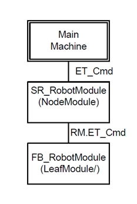
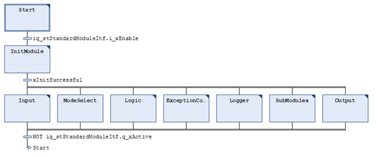
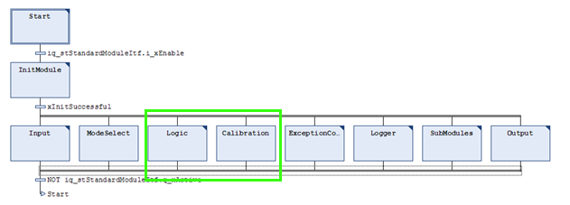

# Additional Information

## Overview

An example project for a regular RoboticModule for PacDrive 3 Template looks like the following.

Under the MainMachine (called in SR\_MainMachine.SubModulesAction), is a NodeModule (named SR\_RobotModule), and under the SR\_RobotModule, the FB\_RobotModule of the library RoboticModule is called (called in SR\_RobotModule.SubModulesAction).

The SR\_RobotModule in the example project looks like this:

**PacDrive 3 Template**

The code that is generated is an enhanced RoboticModule (RobotModule+).

The generated code for SmartTemplate looks like the following graphic, but only the Logic and Calibration is writeable/visible because it needs user adaptations. The other methods/actions are adapted automatically based on the graphical selection.

Adaptations of RobotModule+ compared to the FB\_RobotModule of the library RoboticModule:

* Adaptations of RobotModule+ compared to the FB\_RobotModule of the library RoboticModule:

  + The FB\_RobotModule is initialized by the SR\_RobotModule (Init\_Robot, Init\_A, Init\_B, …)
  + The FB\_RobotModule cannot be used (by default) stand-alone with (or without) the PacDrive 3 Template.
* Adaptations of RobotModule+ compared to the SR\_RobotModule as it is in the example project:

  + The initialization actions are adapted automatically, according to the graphical selected parameter in the Configuration data.

**Other Environments**

A RobotModule as it is described above under PacDrive 3 Template is generated, but it is wrapped in another program to create an interface (VAR\_INPUT, VAR\_OUTPUT, VAR\_IN\_OUT) without template structures.

EIO0000005573.01