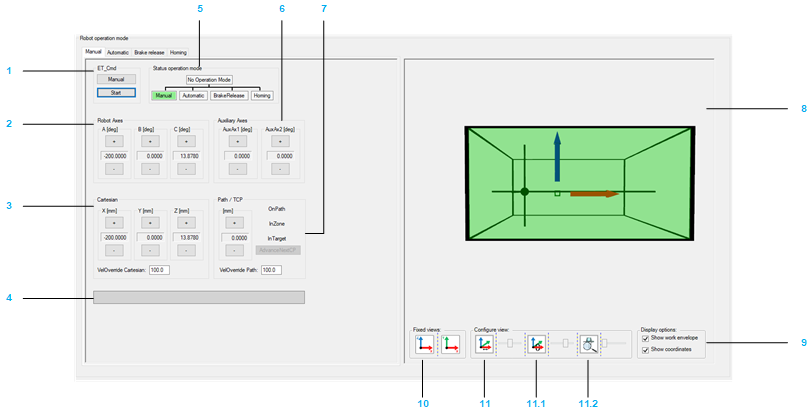
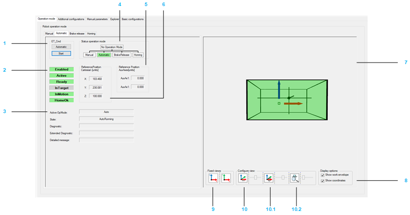
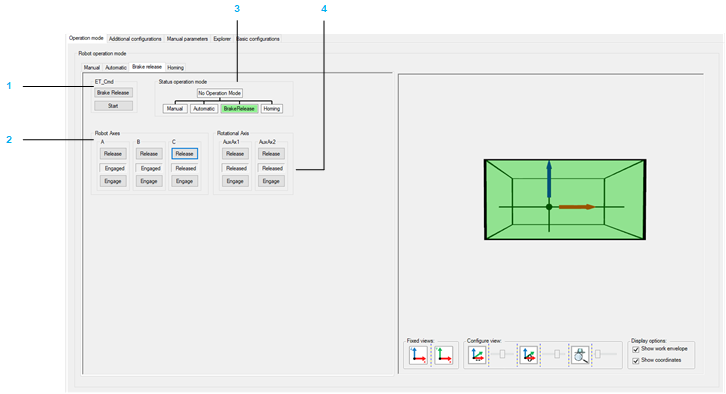
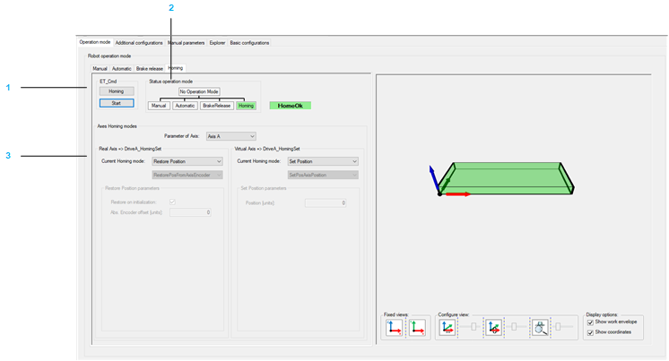

# Operation Mode

## Overview

Refer to the [*Smart Template Modules User Guide*](../../../../../api/crossBook?lang=en-US&virtualBookName=SmrtTplt&topicID=D_SE_0091270) for more information on displaying the different tabs.

The Operation mode tab provides a tab for each operation mode on the left-hand side:

* Manual
* Automatic
* Brake release
* Homing

On the right-hand side, the Operation mode tab displays a visualization of the robot. The visualization can be configured (Display options and Views).

## Manual Tab

* The left-hand side of the Manual tab helps you to move the robot manually.
* The right-hand side of the Manual tab displays the robot movements. The visualization can be configured (Display options and Views).

| WARNING | |
| --- | --- |
|  | UNINTENDED MOVEMENT OF THE AXIS  * Ensure the proper functioning of the functional safety equipment before commissioning. * Ensure that you can stop axis movements at any time using functional safety equipment (limit switch, emergency stop) before and during commissioning.  Failure to follow these instructions can result in death, serious injury, or equipment damage. |

NOTE: If the robot application is offline or the robot module is not called within the application, the controls of the Manual tab are disabled.

Moving the robot manually:

| Item | Description |
| --- | --- |
| 1 | ET\_Cmd  If the module is not in the operation mode Manual, click the Manual button to send the command RM.ET\_Cmd.Manual, and then click the Start button to send the command RM.ET\_Cmd.Start.  NOTE: Alternatively you can send the commands via the [ModuleInterface](../../../../../api/crossBook?lang=en-US&virtualBookName=PD.Lib.Robotic&topicID=D_SE_0080567) (for example, iq\_etCmd).  The displayed Cartesian parameters depend on the configuration of  (refer to Robotic Library Guide).  If the Manual operation mode is accepted, the background color of the operation mode status Manual switches to green. |
| 2 | Robot Axes  Click the buttons (positive / negative) to move (jog) along the robot axes by controlling the corresponding drives. |
| 3 | Cartesian  Click the buttons (positive / negative) to move (jog) the TCP (Tool Center Point) along the axes of the Cartesian coordinate system.  The displayed Cartesian parameters depend on the configuration of *[ET\_WorkingPlane](../../../../../api/crossBook?lang=en-US&virtualBookName=PD.Lib.Robotic&topicID=D_SE_0075495)* (refer to Robotic Library Guide).  VelOverride Cartesian: Proportional influence of the active Cartesian jogging velocity. Unit: % |
| 4 | List box  Displays the pending hardware and software limits. |
| 5 | Status Operation Mode  Displays the operation mode of the module.  If the robot is in Manual operation mode, you can move the robot step-by-step with the buttons of the various jogging modes:   * Jogging along the Cartesian coordinate system (Cartesian) * TCP (Tool Center Point) jogging on path (Path / TCP) * Jogging along the robot axes by controlling the corresponding drives (Robot Axes) |
| 6 | Auxiliary Axes  Click the buttons (positive / negative) to move (jog) the Auxiliary Axes.  NOTE: The buttons are only displayed if Auxiliary Axes have been configured. |
| 7 | Path / TCP  Click the buttons (positive / negative) to move (jog) the TCP (Tool Center Point) along a connected path (if a connected path is available).  For status information on the TCP movement, refer to the feedback properties *[xOnPath](../../../../../api/crossBook?lang=en-US&virtualBookName=PD.Lib.Robotic&topicID=D_SE_0075539)*, xInZone, and xInTarget (refer to Robotic Library Guide).  VelOverride Path: Proportional influence of the active path jogging velocity. Unit: %. |

Configuring the visualization:

| Item | Description |
| --- | --- |
| 8 | Robot visualization  Shows the movement of the robot, particularly the TCP (Tool Center Point) movement within the working plane. |
| 9 | Display options  Activate the check boxes to define what is displayed in the Robot visualization (work envelope, coordinate system). |
| 10 | Fixed views  Click one of the buttons to select a fixed default view of the robot. |
| 11 | Configure view  Move the sliders to configure the rotation, translation, and zoom of the displayed robot.  11.0 Rotation around X-axis  11.1 Translation in direction of X-axis  11.2 Zoom |

## Automatic Tab

* The left-hand side of the Automatic tab provides feedback and diagnostic information on the robot.
* The right-hand side of the Automatic tab displays the robot movements. The visualization can be configured (refer to Manual Tab above).

| Item | Description |
| --- | --- |
| 1 | ET\_Cmd  If the module is not in the operation mode Automatic, click the Automatic button to send the command RM.ET\_Cmd.Auto, and then click the Start button to send the command RM.ET\_Cmd.Start.  NOTE: Alternatively you can send the commands via the [ModuleInterface](../../../../../api/crossBook?lang=en-US&virtualBookName=PD.Lib.Robotic&topicID=D_SE_0080567) (for example, iq\_etCmd).  If the Automatic operation mode is accepted, the background color of the operation mode status Automatic switches to green. |
| 2 | Feedback   * Enabled  A green background color indicates that the module is enabled. * Active  Detailed information can be found under: *[ST\_ModuleInterface.q\_xRobotActive](../../../../../api/crossBook?lang=en-US&virtualBookName=PD.Lib.RoboticModule&topicID=D_SE_0076969)* in RoboticModule Library Guide. * Ready  Detailed information can be found under: *[ST\_ModuleInterface.q\_xRobotReady](../../../../../api/crossBook?lang=en-US&virtualBookName=PD.Lib.RoboticModule&topicID=D_SE_0076969)*  in RoboticModule Library Guide. * InTarget  Detailed information can be found under: *[IF\_RobotFeedback.xInTarget](../../../../../api/crossBook?lang=en-US&virtualBookName=PD.Lib.Robotic&topicID=D_SE_0075539)* in Robotic Library Guide. * InMotion  Detailed information can be found under: *[IF\_RobotFeedback.xInMotion](../../../../../api/crossBook?lang=en-US&virtualBookName=PD.Lib.Robotic&topicID=D_SE_0075539)* in Robotic Library Guide. * HomeOK  Detailed information can be found under: *[ST\_ModuleInterface.q\_xHomeOk](../../../../../api/crossBook?lang=en-US&virtualBookName=PD.Lib.RoboticModule&topicID=D_SE_0076969)* in RoboticModule Library Guide. |
| 3 | Diagnostic  Diagnostics of the robot module. Detailed information can be found under: *[ET\_DiagExt](../../../../../api/crossBook?lang=en-US&virtualBookName=PD.Lib.RoboticModule&topicID=D_SE_0076888)* in RoboticModule Library Guide. |
| 4 | Status Operation Mode  Displays the operation mode of the module. |
| 5 | Reference Position AuxAxes  AuxAxes will only be displayed if Auxiliary Axes have been configured.  Detailed information can be found under: *[IF\_RobotFeedback.ralrRefPositionAuxAx](../../../../../api/crossBook?lang=en-US&virtualBookName=PD.Lib.Robotic&topicID=D_SE_0075539)* in Robotic Library Guide. |
| 6 | Reference Position Cartesian  Detailed information can be found under: *[IF\_RobotFeedback.rstRefPositionTCP](../../../../../api/crossBook?lang=en-US&virtualBookName=PD.Lib.Robotic&topicID=D_SE_0075539)* in Robotic Library Guide. |

Configuring the visualization:

| Item | Description |
| --- | --- |
| 7 | Robot visualization  Shows the movement of the robot, particularly the TCP (Tool Center Point) movement within the working plane. |
| 8 | Display options  Activate the check boxes to define what is displayed in the Robot visualization (work envelope, coordinate system). |
| 9 | Fixed views  Click one of the buttons to select a fixed default view of the robot. |
| 10 | Configure view  Move the sliders to configure the rotation, translation, and zoom of the displayed robot.  10.0 Rotation around X-axis  10.1 Translation in direction of X-axis  10.2 Zoom |

## Brake Release Tab

* The left-hand side of the Brake release tab helps you to release/engage the brake(s) of one or several robot axes.
* The right-hand side of the Brake release tab displays the robot movements. The visualization can be configured (refer to Manual Tab above).

| Item | Description |
| --- | --- |
| 1 | ET\_Cmd  If the module is not in the operation mode BrakeRelease, click the Brake Release button to send the command RM.ET\_Cmd.BrakeRelease, and then click the Start button to send the command RM.ET\_Cmd.Start.  NOTE: Alternatively you can send the commands via the [ModuleInterface](../../../../../api/crossBook?lang=en-US&virtualBookName=PD.Lib.Robotic&topicID=D_SE_0080567) (for example, iq\_etCmd).  If the BrakeRelease operation mode is accepted, the background color of the operation mode status BrakeRelease switches to green. |
| 2 | Robot Axes   * Click the Release button to release the brake of the respective axis. * Click the Engage button to engage the brake of the respective axis.   The indicator between the Release and the Engage button displays the state of the respective brake. |
| 3 | Status Operation Mode  Displays the operation mode of the module. |
| 4 | Auxiliary Axes   * Click the Release button to release the brake of the respective axis. * Click the Engage button to engage the brake of the respective axis.   The indicator between the Release  and the Engage button displays the state of the respective brake. |

## Homing Tab

The Homing tab displays the homing mode of the robot axes.

| Item | Description |
| --- | --- |
| 1 | ET\_Cmd  If the module is not in the operation mode Homing, click the Homing button to send the command RM.ET\_Cmd.Homing, and then click the Start button to send the command RM.ET\_Cmd.Start.  NOTE: Alternatively you can send the commands via the [ModuleInterface](../../../../../api/crossBook?lang=en-US&virtualBookName=PD.Lib.Robotic&topicID=D_SE_0080567) (for example, iq\_etCmd).  If the Homing OK operation mode is accepted, the background color of the operation mode status Homing OK switches to green. |
| 2 | Status Operation Mode  Displays the operation mode of the module. |
| 3 | Virtual/Real  Displays the configured homing mode of the respective axis in case of working mode Virtual and working mode Real.  NOTE: All Homing modes of the Cartesian Robot are supported within the Robotic Module library. |

Homing modes:

| Mode | Description |
| --- | --- |
| Touchprobe | For detailed information about the parameters refer to [PDL.ST\_HomeTp](../../../../../api/crossBook?lang=en-US&virtualBookName=PD.Lib.PacDriveLib&topicID=D_SE_0087739).  You can also find a list of possible Touchprobe modes in [PDL.ET\_HomeTpMode](../../../../../api/crossBook?lang=en-US&virtualBookName=PD.Lib.PacDriveLib&topicID=D_SE_0087226).  Ensure to select the right Touchprobe signal.  NOTE: Due to controller dependent Touchprobe configuration (LMC Pro and Pro2, for example TP\_0; LMC Eco, for example ADI\_1), a message that the default value *0* must be configured to a valid value is displayed. |
| Input / Sensor | For detailed information about the parameters refer to [PDL.ST\_HomeIn](../../../../../api/crossBook?lang=en-US&virtualBookName=PD.Lib.PacDriveLib&topicID=D_SE_0087729).  You can also find a list of possible Input/Sensor modes in the [PDL.ET\_HomeInMode](../../../../../api/crossBook?lang=en-US&virtualBookName=PD.Lib.PacDriveLib&topicID=D_SE_0087216).  Use the property SR\_<CartesianRobotName>.xHomingSensor<A | B | C | ..>. (See chapter [Explorer](Explorer-F6FADFEC.html#Explorer-F6FADFEC)) to set the sensor value. |
| Limit Switch | For detailed information about the parameters refer to [PDL.ST\_HomeLimitSwitch](../../../../../api/crossBook?lang=en-US&virtualBookName=PD.Lib.PacDriveLib&topicID=D_SE_0087731).  You can also find a list of possible Limit Switch modes in the [PDL.ET\_HomeLimitSwitchMode](../../../../../api/crossBook?lang=en-US&virtualBookName=PD.Lib.PacDriveLib&topicID=D_SE_0087218)  To set the signal of the hardware Limit Switch you have to set the corresponding value in the [Logic method](ConfigurationLogicMethodAndModuleIn-F99A913B.html#ConfigurationLogicMethodAndModuleIn-F99A913B__Logic-F99B0B60)(for example iq\_stRoboticModuleItf.iq\_ifHardwareLimit.raxAxisNegative). |
| Torque | For detailed information about the parameters refer to [PDL.ST\_HomeTorque](../../../../../api/crossBook?lang=en-US&virtualBookName=PD.Lib.PacDriveLib&topicID=D_SE_0087737).  You can also find a list of possible Torque modes in the [PDL.ET\_HomeTorqueMode](../../../../../api/crossBook?lang=en-US&virtualBookName=PD.Lib.PacDriveLib&topicID=D_SE_0087224). |
| Move on Position | For detailed information about the parameters refer to [PDL.ST\_HomeMoveOnPos](../../../../../api/crossBook?lang=en-US&virtualBookName=PD.Lib.PacDriveLib&topicID=D_SE_0087733). |
| Set Position | For detailed information about the parameters refer to [PDL.ST\_HomeSetPos](../../../../../api/crossBook?lang=en-US&virtualBookName=PD.Lib.PacDriveLib&topicID=D_SE_0087735).  You can also find a list of possible Torque modes in the [PDL.ET\_HomeSetPosMode](../../../../../api/crossBook?lang=en-US&virtualBookName=PD.Lib.PacDriveLib&topicID=D_SE_0087222). |
| Restore | For detailed information about the parameters refer to [PDL.ST\_HomeSetPos](../../../../../api/crossBook?lang=en-US&virtualBookName=PD.Lib.PacDriveLib&topicID=D_SE_0087729).  You can also find a list of possible Input/Sensor modes in the [PDL.ET\_HomeSetPosMode](../../../../../api/crossBook?lang=en-US&virtualBookName=PD.Lib.PacDriveLib&topicID=D_SE_0087735). |
| Write Position | For detailed information about the parameters refer to [PDL.ST\_HomeWritePos](../../../../../api/crossBook?lang=en-US&virtualBookName=PD.Lib.PacDriveLib&topicID=D_SE_0087741). |

EIO0000004605.04