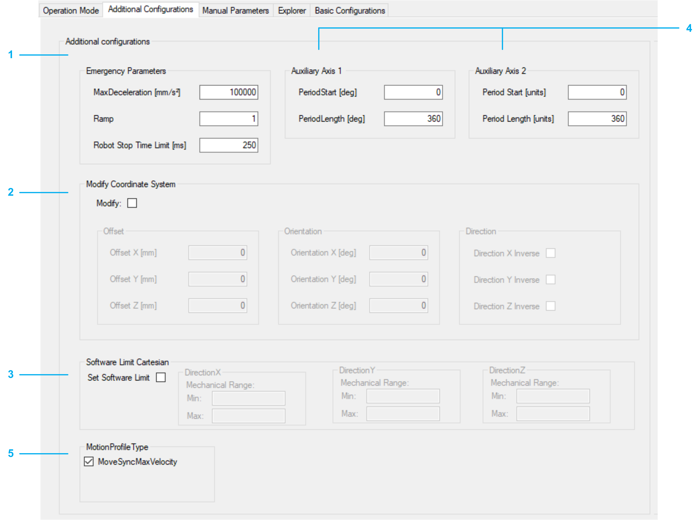

# Additional Configurations

## Overview

| Item | Description |
| --- | --- |
| 1 | Emergency parameters  The necessary data for an emergency stop must be configured.  Detailed information can be found under: *[SetEmergencyParameter](../../../../../api/crossBook?lang=en-US&virtualBookName=PD.Lib.RoboticModule&topicID=D_SE_0076929)* in RoboticModule Library Guide. |
| 2 | Modify coordinate system  The robot coordinate system can be modified. If the checkbox Modify is not selected, the coordinate system is set to default values defined by the selected robot.  Detailed information can be found under: *[ModifyCoordinateSystem2](../../../../../api/crossBook?lang=en-US&virtualBookName=PD.Lib.RoboticModule&topicID=T002816079)* in RoboticModule Library Guide. |
| 3 | SoftwareLimit Cartesian  If Set SoftwareLimit is selected the software limits are set for ROB.ET\_RobotComponent.CartesianX/ CartesianY / CartesianZ. The default values, after Set SoftwareLimit is selected, are the mechanical range values. The method RM.IF\_SoftwareLimit.ExecuteLimits() is called automatically.  Detailed information can be found under: *[IF\_SoftwareLimit](../../../../../api/crossBook?lang=en-US&virtualBookName=PD.Lib.RoboticModule&topicID=D_SE_0076963)* in RoboticModule Library Guide. |
| 4 | Auxiliary Axis 1 / Auxiliary Axis 2  Adapt the period for the auxiliary axis if necessary. Only visible if the robot has an auxiliary axis.  Detailed information can be found under: *[AddAuxAx](../../../../../api/crossBook?lang=en-US&virtualBookName=PD.Lib.RoboticModule&topicID=D_SE_0076915)* in RoboticModule Library Guide. |
| 5 | MotionProfile Type  Select the checkbox for MoveSyncMaxVelocity to use the motion profile ET\_MotionProfileType.MoveSyncMaxVelocity.  Detailed information can be found under: [*IF\_RobotConfigurationAdvanced - SetMotionProfileType*](../../../../../api/crossBook?lang=en-US&virtualBookName=PD.Lib.Robotic&topicID=IF_RobotConfigurationAdvanced_SetMo_41346490) in the Robotic Library Guide.  NOTE: MoveSyncMaxVelocity is only available if an auxiliary axis is configured for the robot. |

EIO0000004605.04