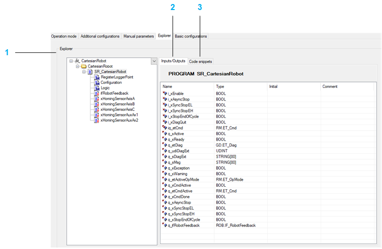
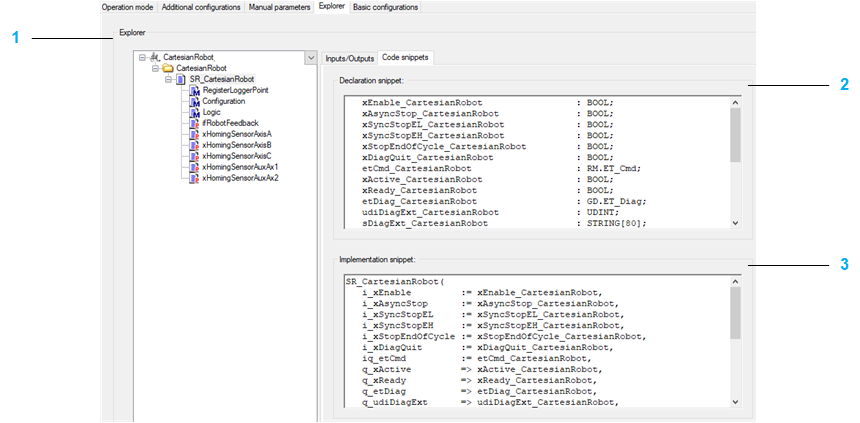

# Explorer

## Overview

The Explorer displays the software structure of the Robot-object.

| Item | Description |
| --- | --- |
| 1 | Overview of the available interface of the robot. |
| 2 | Inputs/Outputs: Detailed interface of the selected item. |
| 3 | Code snippets: Copy the code snippets of this tab to the desired location in your application code.  Detailed information can be found under: *Call robot in your program* in chapter [Using Robot Cartesian](UsingRobotP-Series-F701D8A2.html#UsingRobotP-Series-F701D8A2). |

| Item | Description |
| --- | --- |
| 1 | Declaration snippet: Declaration of the variables |
| 2 | Implementation snippet: Implementation of the code |

EIO0000004605.04