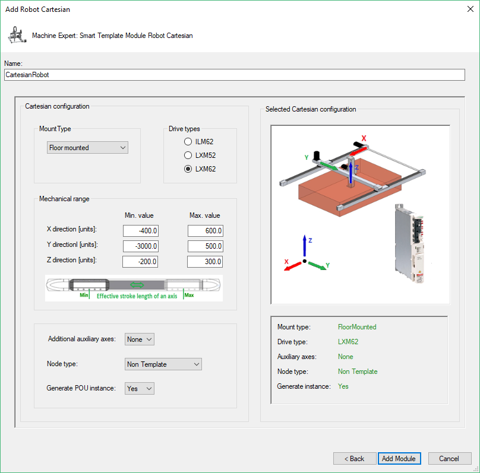

# Add Robot Cartesian

## Dialog Box

| Step | Action |
| --- | --- |
| 1 | Enter a Name for the robot . The created object and the created drives use this name. |
| 2 | Select the Drive type:  * ILM62 * LXM52 * LXM62 |
| 3 | Select the Mount type:  * Floor mounted * Wall mounted * Wall mounted rotated |
| 4 | Set the minimum and maximum values for movement parameters in the Mechanical range field. |
| 5 | Select the Additional auxiliary axes value:   * 0 * 1 * 2 |
| 6 | Select Node Type:   * PacDrive 3 Template: The generated robot is prepared to be used with the PacDrive 3 Template. * Non Template: The generated robot can be used in other EcoStruxure Machine Expert software architectures without PacDrive 3 Template. |
| 7 | Verify the robot configuration that is displayed in Selected Cartesian configuration. You cannot modify the configuration after leaving this dialog box. |
| 8 | Confirm configuration by using the Add Module button to add the configured robot to your project. |

EIO0000004605.04