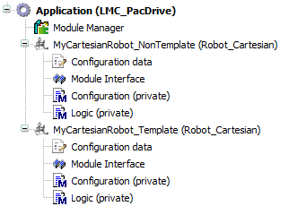

# Configuration / Logic Method and ModuleInterface

## Overview

A robot needs to be programmed with the method Logic.

## Configuration

You can use the method Configuration for additional configuration, for example, to add a tracking system. This method is called once before ConfigDone.

## Logic

With the method Logic, you can add code, for example, to support robot motion.

The method Logic has an input/output (iq\_stRoboticModuleItf).

With the input/output (iq\_stRoboticModuleItf) you access, for example, IF\_RobotMotion to set move commands or IF\_RobotFeedback to receive information of the status of the robot.

If you want to use variables of IF\_RobotFeedback outside of the Logic method (for example for a trace), you can add a variable of type ROB.IF\_RobotFeedback to the ModuleInterface and copy iq\_stRoboticModuleItf.iq\_ifFeedback of Logic to the new variable.

Verify that interface is valid before using it (for example iq\_stRoboticModuleItf.iq\_ifFeedback <> 0).

If you add variables to methods, these variables are volatile variables and are reinitialized with every call of the method. If you need variables that save their data, refer to [Data Exchange with ModuleInterface\Save Data](DataExchangeWithModuleInterface-F9971184.html#DataExchangeWithModuleInterface-F9971184__SaveData-F99742E9).

If you need variables to control your code, refer to [Data Exchange with ModuleInterface](DataExchangeWithModuleInterface-F9971184.html#DataExchangeWithModuleInterface-F9971184).

EIO0000004605.04