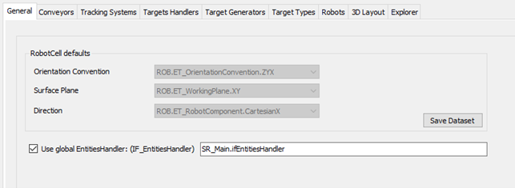

# General Tab

## Overview

In this tab, you can configure the RobotCell Module default parameters.

## RobotCell Defaults

These parameter values are used in several parts of the robot cell. Use the same Orientation Convention, Surface Plane and Direction for the modules in the RobotCell. The parameter value to RobotCell value should be used.

By setting the parameter value to RobotCell value, it is possible to modify the value for the modules globally inside the RobotCell.

| Element | Description |
| --- | --- |
| Orientation Convention | Set the value for the general RobotCell value item from the list. |
| Surface Plan | Set the value for the general RobotCell value item from the list. |
| Direction | Set the value for the general RobotCell value item from the list. |
| Save Dataset | Click this button to save the modified data.  Also refer to [Verifying of Parameter Modifications](VerifyingOfParameterModifications-69725C4F.html). |

## Add Global Entities Handler

Set the checkbox Use global EntitiesHandler: to use a global entities handler. The IEC variable must be of type SERT.IF\_EntitiesHandler or implementing the interface.

NOTE: If the checkbox is not set, a local entities handler inside RobotCell is used.

EIO0000004420.05