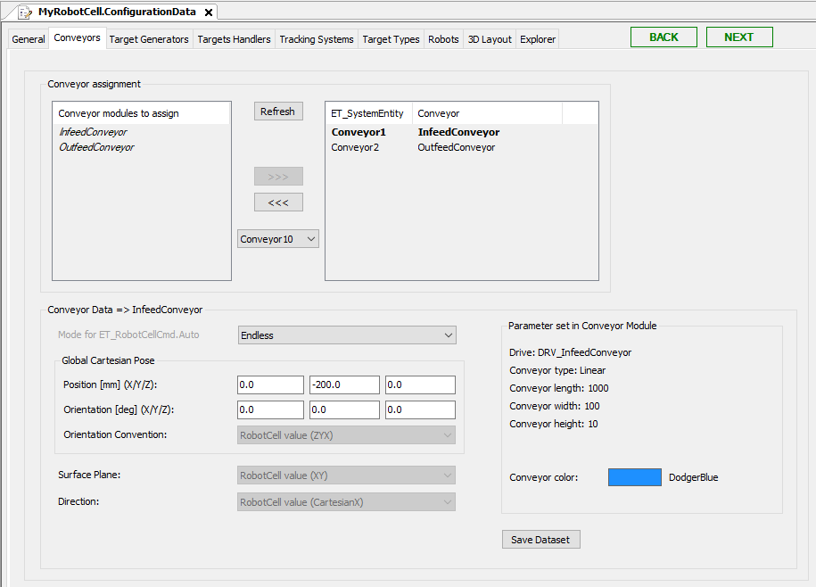

# Conveyors Tab

## Overview

In this tab, you can configure the conveyors which are available in the RobotCell Module.

For how to add robots as submodules, refer to chapter [Add Submodules to a RobotCell Module](AddSubmodulesToA-68E74EA8.html).

After adding conveyors as submodules, they are listed on the left of Conveyor assignment.

Also refer to [How to Use Conveyor of Node Type 'Physical Encoder' in RobotCell Module](TPC_SmrtRobCell_How_Encoder_Conveyor.html#TPC_SmrtRobCell_How_Encoder_Conveyor).

## Conveyor Assignment

When assigning a conveyor to the list of assigned conveyors you can select a value to assign the conveyor with a unique ET\_SystemEntity value.

| Element | Description |
| --- | --- |
| Refresh | Click this button to refresh the list of available conveyors (for example, after adding a conveyor to your application). |
| >>> | Select a conveyor to use in the RobotCell Module and click the >>> button.  **Result:** The conveyor is displayed in the list on the right of Conveyor assignment. |
| <<< | Select a conveyor to remove from being used in the RobotCell Module and click the <<< button.  **Result:** The conveyor is displayed in the list on the left of Conveyor assignment. |

## Conveyor Data

Select a conveyor in the list on the right of Conveyor assignment to display the dataset of the conveyor.

| Element | Description |
| --- | --- |
| Mode for ET\_RobotCellCmd.Auto | Select the auto command mode:   * Endless * Positioning  Depending on the selected mode the Cmd table is generated to send the command Endless or Positioning.  NOTE: If you want to useMultiCam for the conveyor, you have to set the input i\_xDoNotUseDefaultCmdTables to TRUE and set your own command table, for example in Configuration method. For more information, refer to [Using i\_xDoNotUseDefaultCmdTables](UsingI_xDoNotUseDefaultCmdTables-68F39A2B.html#UsingI_xDoNotUseDefaultCmdTables-68F39A2B). |
| Global Cartesian Pose  > Position (X/Y/Z) | Enter the Cartesian positions X/Y/Z.  NOTE: The Cartesian position refers to the coordinate system of the robot cell. It does not refer to the coordinate system of the conveyor itself. |
| Global Cartesian Pose  > Orientation | Enter the conveyor orientation X/Y/Z. |
| Global Cartesian Pose  > Orientation Convention | Select the general RobotCell value or choose another ROB.ET\_OrientationConvention item from the list. |
| Surface Plane | Select the general RobotCell value or choose another ROB.ET\_WorkingPlane item from the list. |
| Direction | Select the general RobotCell value or choose another ROB.ET\_RobotComponent item from the list. |
| Save Dataset | Click this button to save the modified data.  Also refer to [Verifying of Parameter Modifications](VerifyingOfParameterModifications-69725C4F.html). |

## Parameters Set in Conveyor Module

The Parameter set in Robot Module area summarizes the parameters of the conveyor module. To modify the parameters use the Configuration data tab of the conveyor submodule

EIO0000004420.05