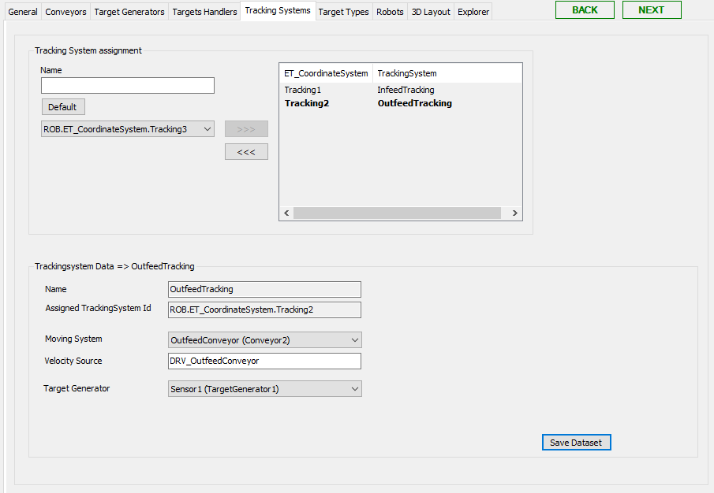

# Tracking Systems Tab

## Overview

In this tab, you can configure the tracking systems of the RobotCell Module.

You can configure up to 30 tracking systems. To use a tracking system for a robot, you have to assign it in the Tracking System Data of the Robots [tab](RobotsTab-66D3DF61.html#RobotsTab-66D3DF61__TrackingSystemData-674483AD) .

Also refer to [How to Use Conveyor of Node Type 'Physical Encoder' in RobotCell Module](TPC_SmrtRobCell_How_Encoder_Conveyor.html#TPC_SmrtRobCell_How_Encoder_Conveyor).

## Tracking System Assignment

| Element | Description |
| --- | --- |
| Name | Enter a name for the tracking system. |
| Default | Click this button to create a default Name for the tracking system. The name is derived from the selected ROB.ET\_CoordinateSystem.Tracking<N>. |
| ROB.ET\_CoordinateSystem.Tracking<N> | Select a tracking system Id from the list. Possible values are:  ROB.ET\_CoordinateSystem.Tracking1...ROB.ET\_CoordinateSystem.Tracking30  An already assigned tracking system Id is no longer available in the list. If you remove a tracking system Id, it is available in the list again. |
| >>> | Click this button to use the created tracking system in the RobotCell Module.  **Result:** The tracking system is displayed in the list on the right of Linear Tracking System Assignment. |
| >>> | Click this button to remove the tracking system from being used in the RobotCell Module.  **Result:** The tracking system is displayed in the list on the left of Linear Tracking System Assignment.  If you use the >>> button, you are prompted by a dialog box to confirm. |

## Tracking System Data

Select a tracking system in the list on the right of Tracking System Assignment to display the dataset of the tracking system.

| Element | Description |
| --- | --- |
| Name | Name of the selected tracking system. |
| Assigned Tracking System Id | Id of the selected tracking system. |
| Moving System | Select a conveyor from the list. |
| Velocity Source | Enter the velocity source, for example, the drive of a conveyor. |
| Target Generator | Select a camera, sensor or external target generator from the list. |
| Save Dataset | Click this button to save the modified data.  Also refer to [Verifying of Parameter Modifications](VerifyingOfParameterModifications-69725C4F.html). |

EIO0000004420.05