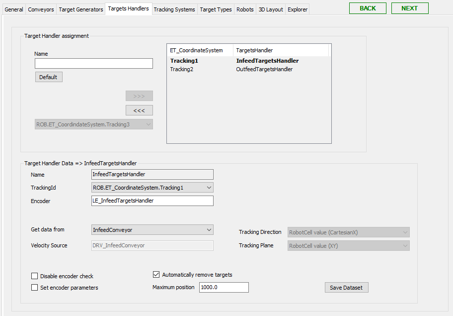

# Target Handlers Tab

## Overview

In this tab, you can create target handlers, for example, to handle targets on a conveyor, to add/remove targets, and track targets.

Targets generated by targets generators such as camera and sensor modules can be managed by target handlers.

Also refer to [How to Use Conveyor of Node Type 'Physical Encoder' in RobotCell Module](TPC_SmrtRobCell_How_Encoder_Conveyor.html#TPC_SmrtRobCell_How_Encoder_Conveyor).

## Target Handler Assignment

| Element | Description |
| --- | --- |
| Name | Enter a name for the target handler. |
| Default | Click this button to create a default Name for the target handler. |
| >>> | Click this button to use the created target handler in the RobotCell Module.  **Result:** The target handler is displayed in the list on the right of Target Handler Assignment. |
| >>> | Click this button to remove the target handler from being used in the RobotCell Module.  **Result:** The target handler is displayed in the list on the left of Target Handler Assignment.  If you use the >>> button, you are prompted by a dialog box to confirm. |

## Target Handler Data

Select a target handler in the list on the right of Target Handler Assignment to display the dataset of the target handler.

| Element | Description |
| --- | --- |
| Name | Name of the selected target handler. |
| Tracking Id | Id of the selected tracking system.  Select a tracking system Id from the list. Possible values are:  ROB.ET\_CoordinateSystem.Tracking1...ROB.ET\_CoordinateSystem.Tracking30 |
| Encoder | Enter the encoder assigned to this target handler.  It is a best practice not to edit the displayed default name. If you modify the name of the logical encoder, note that this logical encoder is available, and positions are updated.  The logical encoder is necessary to update the position of the targets. |
| Get data from | Select the source where the target handler gets data from. Possible values are:   * Custom  If you select Custom, you must configure the parameters of the target handler. * <Conveyor>  If you select a conveyor, the parameters of the target handler are retrieved from the conveyor. These parameters are read-only. |
| Velocity Source | Enter the velocity source, for example, the drive of a conveyor the target handler is linked to. |
| Tracking Direction | Select the general RobotCell value or choose another ROB.ET\_RobotComponent item from the list. |
| Tracking Plane | Select the general RobotCell value or choose another ROB.ET\_WorkingPlane item from the list.  This is the Surface Plane defined in the General tab. |
| Disable encoder check | If you enable this check box, the parameters of the encoder are not verified.  If you disable this check box, the parameters of the encoder are verified and compared with the velocity source parameters. |
| Set encoder parameters | If you enable this check box, the parameters FeedConstant, GearIn, GearOut, and Direction of the encoder are set to the parameters of the velocity source. |
| Automatically remove targets | If you enable this check box, the targets are automatically removed from the targets handler, if the position value is greater than the value set for Maximum position. |
| Maximum position | Maximum position for handling targets. |
| Save Dataset | Click this button to save the modified data.  Also refer to [Verifying of Parameter Modifications](VerifyingOfParameterModifications-69725C4F.html). |

For detailed information on the parameters, refer to SERT.FB\_TargetsHandler.

EIO0000004420.05