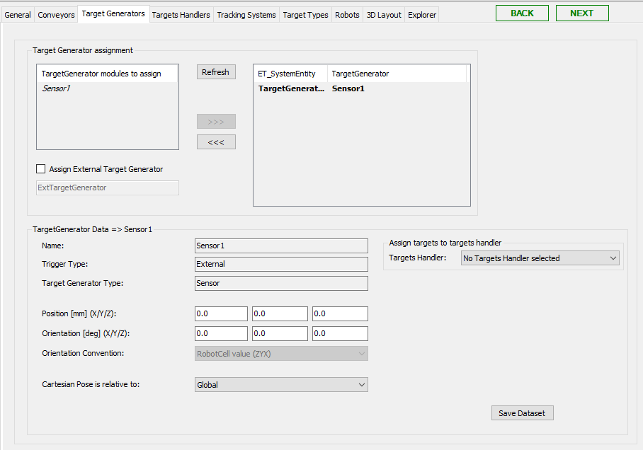

# Target Generators Tab

## Overview

This tab displays the modules (cameras, sensors) available in the RobotCell Module that can create targets.

For how to add target generators as submodules, refer to chapter [Add Submodules to a RobotCell Module](AddSubmodulesToA-68E74EA8.html).

After adding cameras or sensors as submodules, they are listed on the left of Target Generator assignment.

## Target Generator Assignment

| Element | Description |
| --- | --- |
| Refresh | Click this button to refresh the list of available cameras/sensors. |
| >>> | Select a camera or sensor to use in the RobotCell Module and click the >>> button.  **Result:** The camera/sensor is displayed in the list on the right of Target Generator assignment. |
| <<< | Select a camera or sensor to remove from being used in the RobotCell Module and click the <<< button.  **Result:** The camera/sensor is displayed in the list on the left of Target Generator assignment. |

NOTE: Assigned Target Generator modules will be displayed in *italic* text font.

## Target Generator Data

Select a camera or sensor in the list on the right of Target Generator assignment to display the dataset of the camera/sensor.

| Element | Description |
| --- | --- |
| Name | Displays the name of the selected camera/sensor. |
| Trigger Type | Displays the trigger type of the selected camera/sensor. |
| Target Generator Type | Displays the target generator type of the selected camera/sensor. |
| Cartesian Position (X/Y/Z) | Enter the Cartesian positions X/Y/Z.  NOTE: The Cartesian position refers to the coordinate system of the robot cell. It does not refer to the coordinate system of the camera/sensor itself. |
| Orientation | Enter the camera/sensor orientation X/Y/Z. |
| Orientation Convention | Select the general RobotCell value or choose another ROB.ET\_OrientationConvention item from the list. |
| Cartesian Pose is relative to | Possible values are:   * Global  SERT.ET\_SystemEntity.Global * <Conveyor>  Select a conveyor (added to the robot cell) the Cartesian pose is relative to. |
| Assign targets to targets handler | If a targets handler is selected from the list, the targets of the selected target generator are automatically added to the selected targets handler. If the default value No Targets Handler selected is set, the targets of the target generator are not added to any target handler automatically. |
| Save Dataset | Click this button to save the modified data.  Also refer to [Verifying of Parameter Modifications](VerifyingOfParameterModifications-69725C4F.html). |

EIO0000004420.05