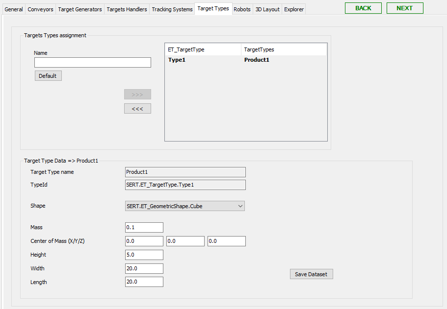

# Target Types Tab

## Overview

In this tab, you can create target types, for example, to display different target types with regard to shape, and size in a visualization. For DigitalTwin, target types are automatically written to DTC.GVL\_OpcUaTargetTypes.G\_stTargetTypes.

## Target Types Assignment

| Element | Description |
| --- | --- |
| Name | Enter a name for the target type. |
| Default | Click this button to create a default Name for the target type. |
| >>> | Click this button to use the created target type in the RobotCell Module.  **Result:** The target type is displayed in the list on the right of Target Type Assignment. |
| >>> | Click this button to remove the target type from being used in the RobotCell Module.  **Result:** The target type is displayed in the list on the left of Target Type Assignment.  If you use the >>> button, you are prompted by a dialog box to confirm. |

## Target Type Data

Select a target type in the list on the right of Target Type Assignment to display the dataset of the target type.

| Element | Description |
| --- | --- |
| Target Type Name | Name of the selected target type. |
| Type Id | Id of the selected target type. The Id is automatically created from the target type name, for example, SERT.ET\_TargetType.Type1. |
| Shape | Select a parameter for the shape. Possible values are:  SERT.ET\_GeometricShape.Cube ... SERT.ET\_GeometricShape.Box  Set this parameter to a value unequal to SERT.ET\_GeometricShape.None. |
| Mass | Enter a value for the mass of the target type. |
| Center of Mass (X/Y/Z) | Enter the value for the center of the mass of the target type (X/Y/Z). |
| Height | Enter a value for the height of the target type. |
| Width | Enter a value for the width of the target type. |
| Length | Enter a value for the length of the target type. |
| Save Dataset | Click this button to save the modified data.  Also refer to [Verifying of Parameter Modifications](VerifyingOfParameterModifications-69725C4F.html). |

EIO0000004420.05