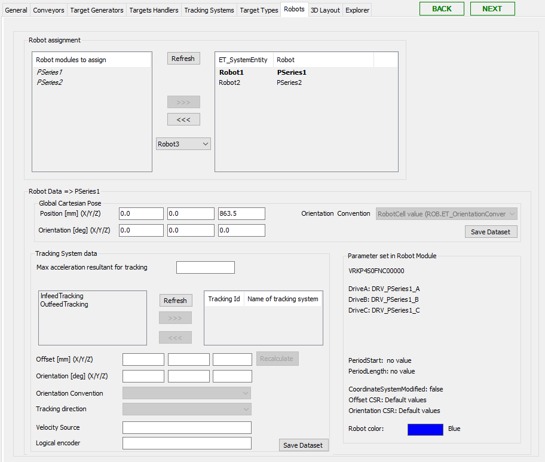

# Robots Tab

## Overview

In this tab, you can configure the robots which are available in the RobotCell Module.

For how to add robots as submodules, refer to chapter [Add Submodules to a RobotCell Module](AddSubmodulesToA-68E74EA8.html).

After adding robots as submodules, they are on the left of Robot assignment.

## Robot Assignment

When assigning a robot to the list of assigned robots you can select a value to assign the robot with a unique ET\_SystemEntity value.

| Element | Description |
| --- | --- |
| Refresh | Click this button to refresh the list of available robots (for example, after adding a robot to your application). |
| >>> | Select a robot to use in the RobotCell Module and click the >>> button.  **Result:** The robot is displayed in the list on the right of Robot assignment. |
| <<< | Select a robot to remove from being used in the RobotCell Module and click the <<< button.  **Result:** The robot is displayed in the list on the left of Robot assignment. |

## Robot Data

Select a robot in the list on the right of Robot assignment to display the dataset of the robot.

| Element | Description |
| --- | --- |
| Cartesian Position Robot (X/Y/Z) | Enter the Cartesian positions X/Y/Z.  NOTE: The Cartesian position refers to the coordinate system of the robot cell. It does not refer to the coordinate system of the robot itself. The coordinate system of the robot can be adapted in the Configuration data tab of the robot submodule. For example, for a Robot P-Series under Configuration data > Additional configuration. |
| Robot Orientation | Enter the robot orientation X/Y/Z. |
| Orientation Convention | Select the general RobotCell value or choose another ROB.ET\_OrientationConvention item from the list.  It is a best practice to use the default robot cell values. |
| Save Dataset | Click this button to save the modified data.  Also refer to [Verifying of Parameter Modifications](VerifyingOfParameterModifications-69725C4F.html). |

## Tracking System Data

To assign a tracking system, a tracking system must already be configured in the tab Tracking System. Refer to chapter [Tracking System Tab](LinearTrackingSystemsTab-68D2C395.html).

A robot can have several tracking systems. For the maximum number of tracking systems, refer to ROB.ET\_CoordinateSystem.

| Element | Description |
| --- | --- |
| Max acceleration resultant for tracking | This parameter must be set to a value > 0. The method ROB.IF\_RobotMotion.SetMaxAccelerationResultant() is set for ROB.ET\_RobotComponent.Tracking.  NOTE: The value of the maximum acceleration resultant for tracking is valid for the tracking systems of the robot. |
| Refresh | Click this button to refresh the list of available tracking systems. |
| >>> | Select a tracking system to use in the RobotCell Module and click the >>> button.  **Result:** The tracking system is displayed in the list on the right of Tracking system data. |
| <<< | Select a robot to remove from being used in the RobotCell Module and click the <<< button.  **Result:** The tracking system is displayed in the list on the left of Tracking system data and is no longer used within RobotCell. |
| Set the values for the following parameters. These values are used to call the method AddLinearTrackingSystem3 for the selected robot and a linear tracking system is added. | |
| Offset | Shifting of the origin of the linear tracking system in relation to the robot coordinate system ROB.ET\_CoordinateSystem.CSR. Unit: [mm] |
| Orientation | Rotation of the linear tracking system in relation to the robot coordinate system ROB.ET\_CoordinateSystem.CSR. Unit: [°] |
| Orientation Convention | Convention for the rotation angles of the orientation (ROB.ET\_OrientationConvention). |
| Tracking direction | Positive Cartesian axis of the tracking coordinate system which is used for tracking (ROB.ET\_RobotComponent). |
| Velocity Source | Velocity source of the linear tracking system. |
| Logical encoder | Logical encoder which is linked to the velocity source. |
| Save Dataset | Click this button to save the modified data.  Also refer to [Verifying of Parameter Modifications](VerifyingOfParameterModifications-69725C4F.html). |

## Parameters Set in Robot Module

The Parameter set in Robot Module area summarizes the parameters of the robot module. To modify the parameters use the Configuration data tab of the robot submodule.

EIO0000004420.05