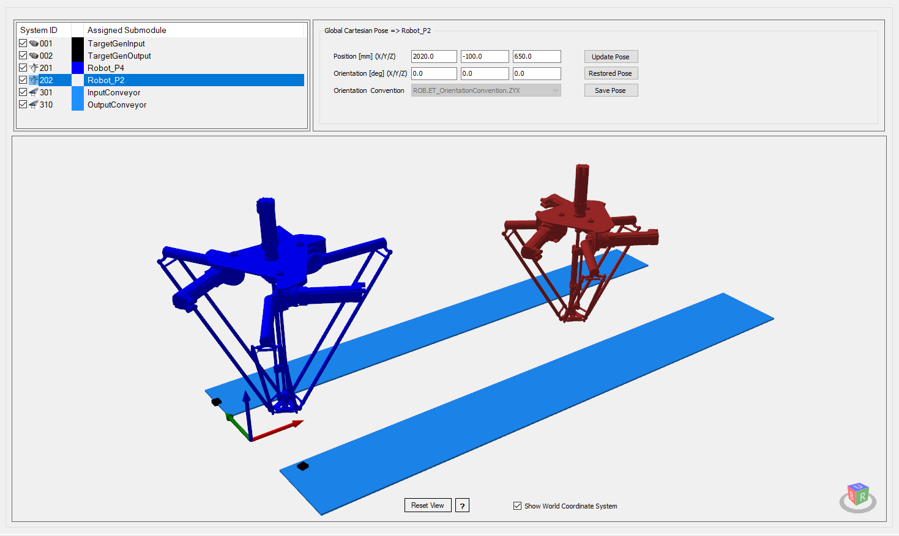
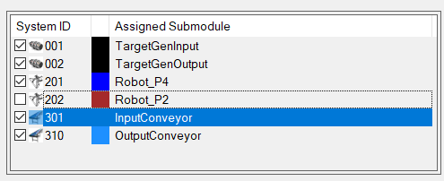
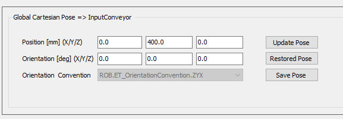
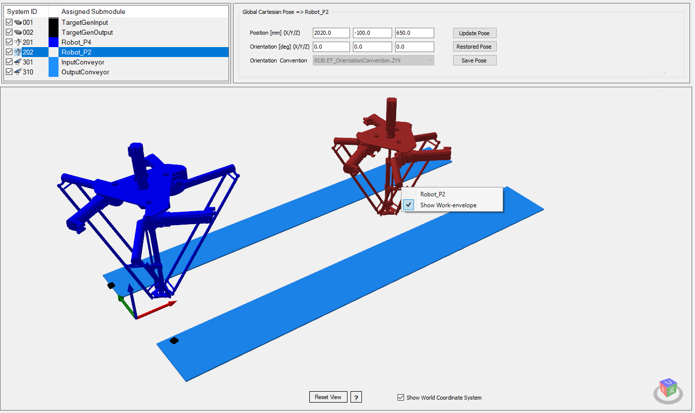

# 3D Layout Tab

## Overview

By assigning conveyors, target generators and robots in their respective Robotcell tab, the corresponding submodules of the same are displayed in the 3D scene of the 3D Layout tab.

The following example gives a general overview about the visualization of the 3D layout.

It shows global positions of configured conveyors, target generators and robots (with or without work envelope).

Additionally, the global world origin of the scene is shown. It also can be hidden.

## Operation Regions

The 3D Layout View tab is partitioned into three different function regions:

| Element | Description |
| --- | --- |
| List of assigned submodules | Displays the assigned conveyor, robot and camera/sensor (target generators) submodules of the Robotcell. |
| Global Cartesian Pose | Displays the properties of the selected module. |
| 3D Layout | Displays the3D layout of the project. |

## Assigned Submodules List

| Element | Description |
| --- | --- |
| System ID | You can select or deselect the check box, to show or hide the submodule within the 3D layout. Also a submodule type icon and its assigned system ID number is displayed. |
| Color Icon | Displays the chosen 3D layout color of the submodule. |
| Assigned Submodule | Displays the name of the submodule. |

## Global Cartesian Pose Property Area

By selecting a module of the list, for example, the Robot\_P2, the corresponding Global Cartesian Pose data are displayed.

| Element | Description |
| --- | --- |
| Position | Displays the position values, which you can modify. |
| Orientation | Displays the orientation values, which you can modify. |
| Orientation Convention | Displays the chosen orientation convention, which you cannot modify. |
| Update Pose | By clicking the button, the modified values are updated. |
| Restored Pose | By clicking the button, the stored Robotcell data values are used and the modifications are overwritten. |
| Save Pose | By clicking the button, the modified pose values are saved in the Robotcell data. |

NOTE:

Update, Restore and Save Pose immediately redraws the 3D Layout scene.

If modified values have not been saved, and you change the selected submodule item, are you prompted to save.

## 3D Layout Display Area

The 3D Layout display shows the 3D scene with the assigned submodules from the list.

| Element | Description |
| --- | --- |
| Visible Submodules | Displays the submodule models in the scene (conveyors, robots, target generators)  NOTE: Conveyor, robot and target generator submodules are assigned within the corresponding Robotcell tabs.  By assigning, the submodule it is inserted into the scene.  By removing the assignment, the submodule is removed from the scene. |
| Pop-up Element | By clicking on the submodule in the scene, the submodule is selected in the list of assigned submodules  and a contextual menu with the name and possible action is displayed.  NOTE: The robots work-envelopes are hidden by default, but can be displayed by contextual menu action. |
| Reset View | By clicking the button, the view of the scene is reset. |
| ? | Button to show a Pocket Guide for manipulating the scene. |
| Checkbox | Checkbox to hide or show the global coordinate system. |
| Cube Icon | Changes the view of the scene by mouse or keyboard: move, rotate or zoom. |

EIO0000004420.05