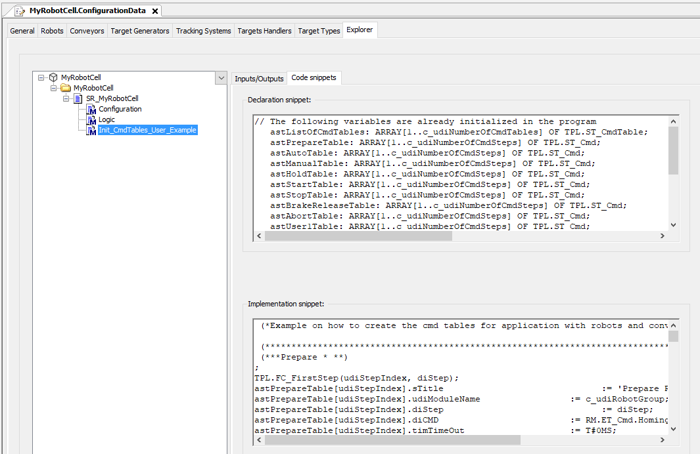

# Using i\_xDoNotUseDefaultCmdTables

## Overview

* If i\_xDoNotUseDefaultCmdTables is set to FALSE, the CmdTable is generated automatically. The robots and conveyor automatically switch to the operation mode that is set for the RobotCell.

  For example: SR\_<RobotCell>.iq\_stStandardModuleItf.iq\_diCmd := SERT.ET\_RobotCellCmd.Prepare executes a homing for robots and conveyor.
* If i\_xDoNotUseDefaultCmdTables is set to TRUE, create the command tables and call them.

  A way to do this is to create a method for the SR\_<RobotCell>, for example, Init\_Cmd\_Tables\_User and to call this method in the configuration method of SR\_<RobotCell>.Configuration().

  The [Explorer Tab](ExplorerTab-68E33570.html) provides for Init\_Cmd\_Tables\_User in the Code snippets tab, the method Init\_CmdTables\_User\_Example that contains the variables that are already declared in the SR\_<RobotCell> and an example of how the tables could be filled in case of robots and two conveyors.

EIO0000004420.05