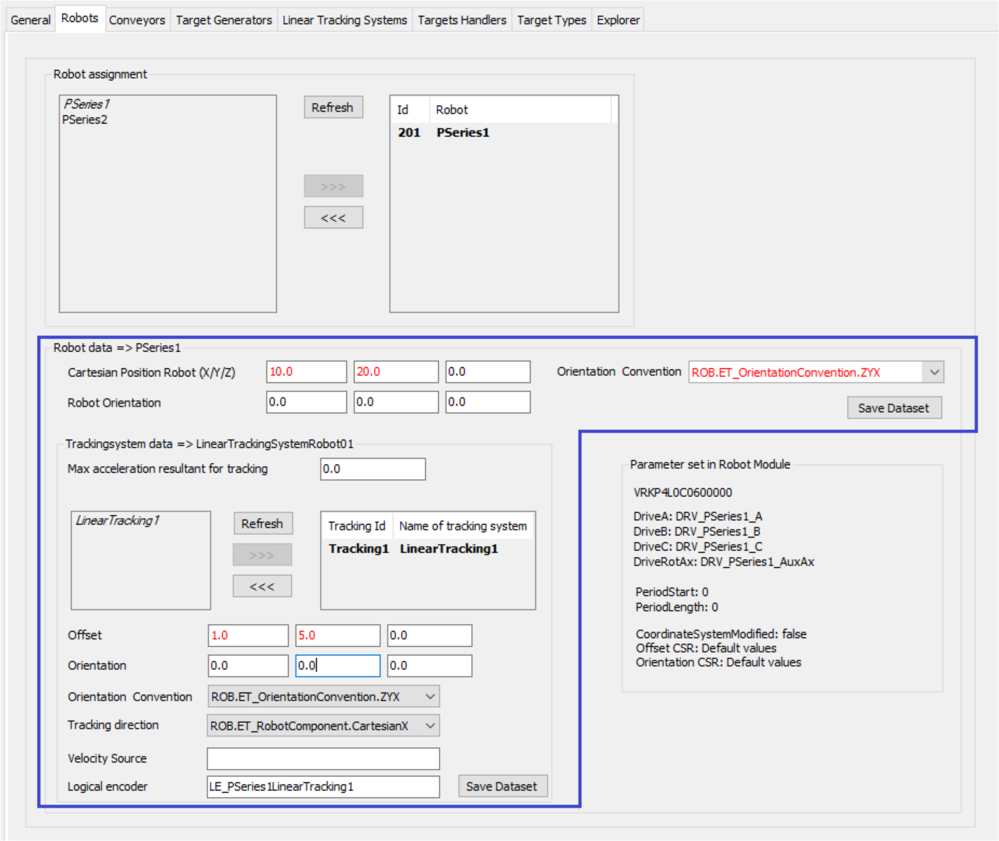
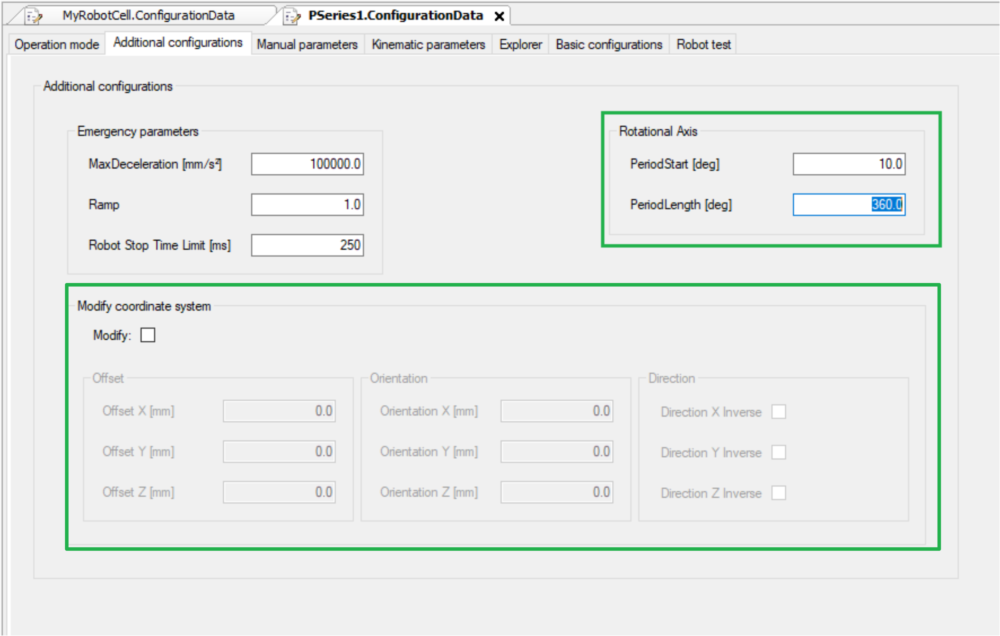

# Verifying of Parameter Modifications

## Overview

In general, you must click the Save Dataset button after modifying parameters or settings.

If you do not save the data and switch the dataset focus, the modified parameters are discarded.

You leave the present dataset focus by:

* Switching the submodule dataset selection within the <Module> assignment of a tab.
* Deselecting a submodule dataset.
* Switching from one robot cell submodule tab to another, for example, from the Robots to the Conveyor tab.
* Leaving the RobotCell Module editor.

## Verifying of Parameter Modifications

To help to prevent discarding of parameter modifications, a verification feature is implemented.

This feature, realized for the various RobotCell Module submodule tabs, provides two functions:

* Modified parameters are displayed in red until you click the Save Dataset button.
* If you switch the focus to another edit field, a message is displayed informing you that data has been modified and was not saved.

There are two different types of data that is verified:

* Data within the RobotCell Module tabs.
* Data within the submodules of a robot cell that cannot be modified in the RobotCell Module tabs.

## Data within the RobotCell Module Tabs

The following example displays the Robots tab of the RobotCell Module.

The parameters in the robot cell dataset (blue frame) are verified whether they were modified regarding the presently stored values.

Modified values are displayed in red to indicates that the values were modified but not saved.

If you leave the Robots tab, a message is displayed informing you that data were modified and were not saved. You have to confirm to save the modified data with Yes or discard the modifications with No.

## Data within the Submodules of a Robot Cell

The following example displays the Additional configuration tab of a Robot P-Series which is a submodule of the RobotCell Module.

The parameters of the robot cell submodule (the values in the green frame are coming from the Robot P-Series) are read-only in the RobotCell Module Robots tab and can only be modified in Additional configuration tab of a Robot P-Series module.

Modifying data in the Additional configuration tab of a Robot P-Series module is also verified and you have to confirm the modifications.

EIO0000004420.05