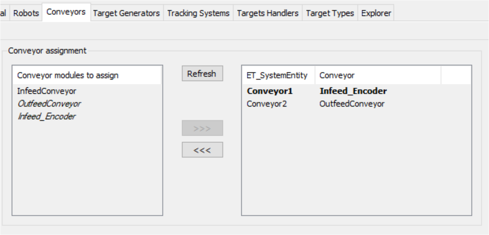
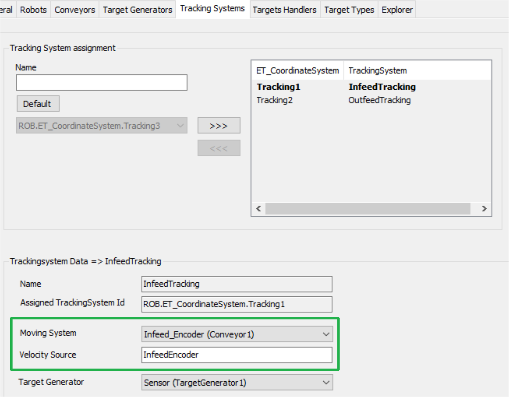
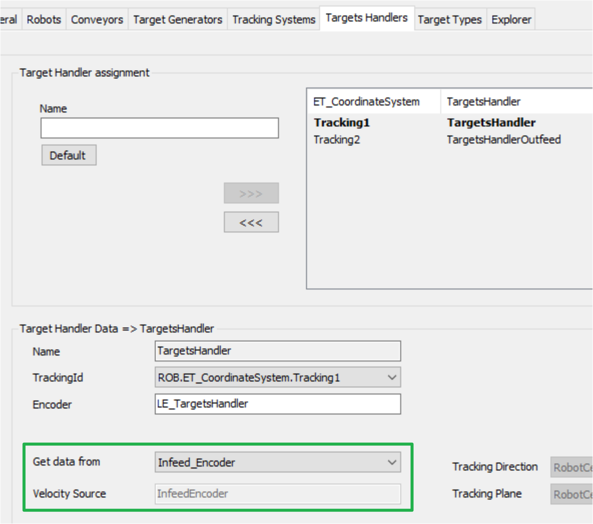
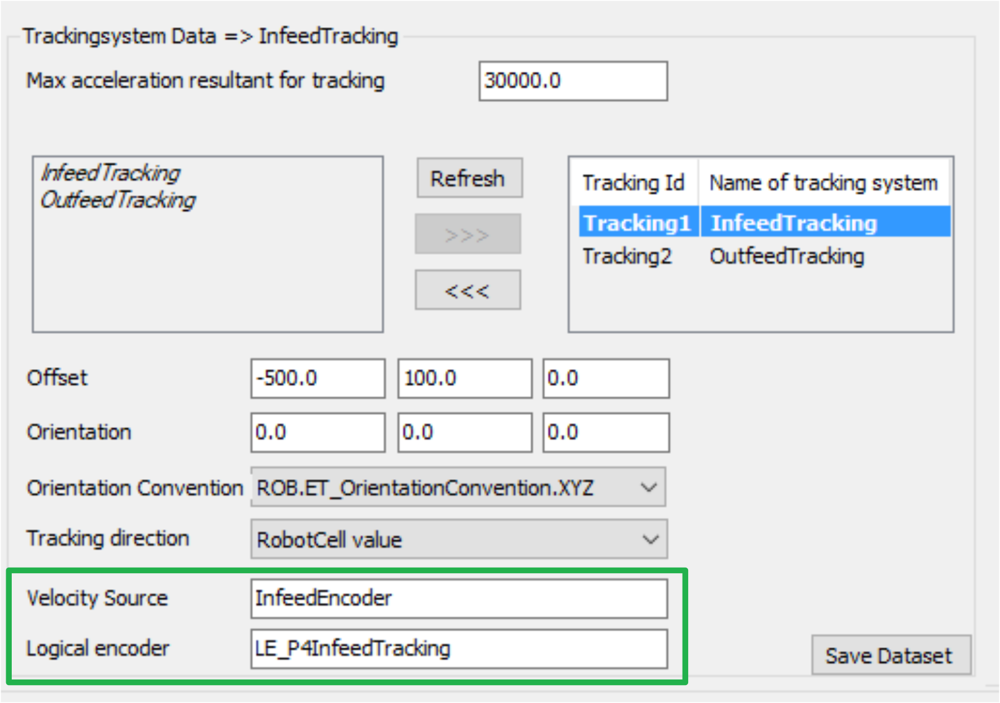
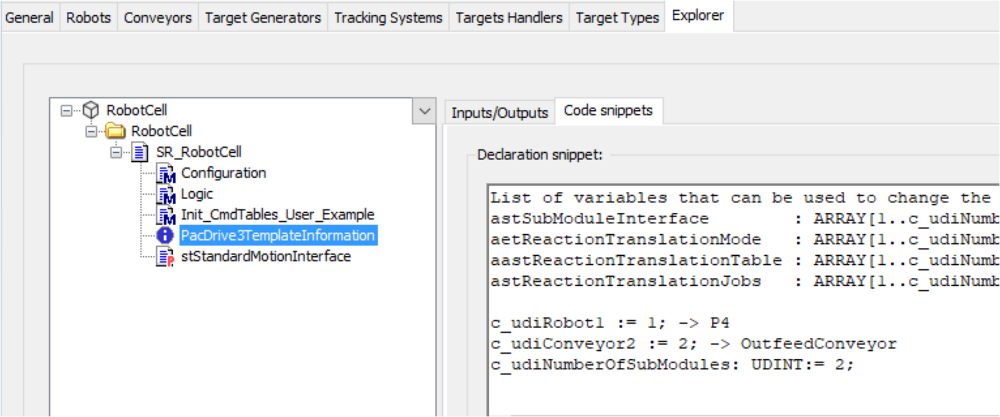

# How to Use Conveyor of Node Type 'Physical Encoder' in RobotCell Module

## Conveyors Tab of the RobotCell Module

Conveyors of node type 'Physical encoder' are also part of the list of Conveyor modules to assign and can be assigned like conveyors of node type 'PacDrive 3 Template' or 'Non Template'.

Also refer to [Conveyors Tab](ConveyorsTab-674BAE11.html).

## Tracking Systems, Targets Handlers and Robots Tabs of the RobotCell Module

For the Tracking Systems tab, theTargets Handlers tab and the tracking system data of a robot in the Robots tab, conveyors of node type 'Physical encoder' can be used as conveyors of node type 'PacDrive 3 Template' or 'Non Template'. In this case the encoder is set as velocity source instead of a drive.

Also refer to [Tracking Systems Tab](LinearTrackingSystemsTab-68D2C395.html), [Target Handlers Tab](TargetHandlersTab-68D9ADC1.html) and [Robots Tab](RobotsTab-66D3DF61.html).

## No ‘PacDrive 3 Template’ Modules

Conveyors of node type 'Physical encoder' are no ’PacDrive 3 Template’ modules.

If, for example, you have two conveyors with:

* Conveyor1 (Infeed\_Encoder) is of node type 'Physical encoder'
* Conveyor2 (OutfeedConveyor) is of node type 'PacDrive 3 Template' running in endless mode

In the Explorer tab, PacDrive3TemplateInformation is listed only for Conveyor2 (OutfeedConveyor), because Conveyor1 (Infeed\_Encoder) is not a PacDrive3Template node.

Commands that are set via the SR\_<RobotCell>.iq\_stStandardModuleItf will not affect the Conveyor1 (Infeed\_Encoder) in this example.

EIO0000004420.05