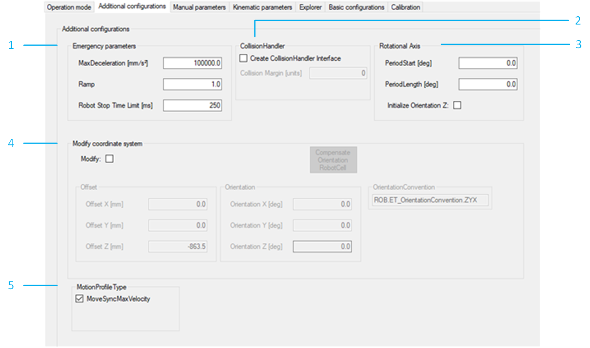

# Additional Configurations

## Overview

|  |  |
| --- | --- |
| 1 | Emergency parameters  The necessary data for an emergency stop must be configured.  Detailed information can be found under: *[SetEmergencyParameter](../../../../../api/crossBook?lang=en-US&virtualBookName=PD.Lib.RoboticModule&topicID=D_SE_0076929)*. |
| 2 | CollisionHandler  Select the checkbox Create CollisionHandler Interface to configure the collision handler. If the checkbox Create CollisionHandler Interface is selected, the Collision Margin value can be set.  The property SR\_<Robot\_P-Series\_Name>.ifCollisionHandlerPSeries is configured based on this configuration.  Detailed information can be found under: [*FB\_CollisionHandlerPSeries*](../../../../../api/crossBook?lang=en-US&virtualBookName=PD.Lib.SchneiderElectricRobotics&topicID=FB_CollisionHandlerPSeries_GeneralI_04E6B210). |
| 3 | Rotational Axis  Adapt the period of the rotational axis if necessary. Only visible if the robot has a rotational axis.  Detailed information can be found under: *[AddAuxAx](../../../../../api/crossBook?lang=en-US&virtualBookName=PD.Lib.RoboticModule&topicID=D_SE_0076915)*.  Configure the robot with the rotational axis mapped to [SER.IF\_RobotPSeries - InitializeOrientationZ](../../../../../api/crossBook?lang=en-US&virtualBookName=PD.Lib.SchneiderElectricRobotics&topicID=E44C2888). |
| 4 | Modify coordinate system  The robot coordinate system can be modified. If the checkbox Modify is not set, the coordinate system is set to default values defined by the selected robot.  In case the robot is a submodule of RobotCell and orientation was modified in RobotCell, a button Compensate Orientation RobotCell is displayed. If you click the button the according values are overwritten.  NOTE: In case you have modified the orientation in RobotCell, a prompt reminds you to verify whether a compensation on Robot level is required.  Detailed information can be found under: *[ModifyCoordinateSystem2](../../../../../api/crossBook?lang=en-US&virtualBookName=PD.Lib.RoboticModule&topicID=T002816079)*. |
| 5 | MotionProfile Type  Set checkbox for MoveSyncMaxVelocity to use the motion profile ET\_MotionProfileType.MoveSyncMaxVelocity.  Detailed information can be found under: [*IF\_RobotConfigurationAdvanced - SetMotionProfileType*](../../../../../api/crossBook?lang=en-US&virtualBookName=PD.Lib.Robotic&topicID=IF_RobotConfigurationAdvanced_SetMo_41346490).  NOTE: MoveSyncMaxVelocity is only available if a rotational axis is configured for the robot. |

EIO0000002369.12