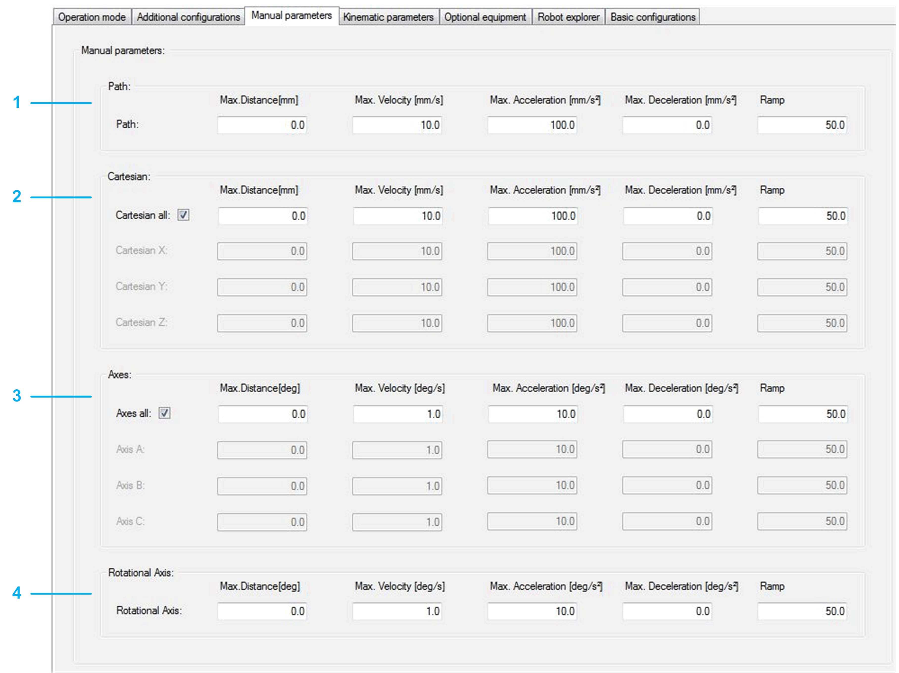

# Manual Parameters

## Overview

|  |  |
| --- | --- |
| 1 | Path: Initial parameter for jogging along the robot path.  Detailed information can be found under: *[SetParameter](../../../../../api/crossBook?lang=en-US&virtualBookName=PD.Lib.RoboticModule&topicID=D_SE_0076961)* in RoboticModule Library Guide. |
| 2 | Cartesian: Initial parameter for jogging the TCP (Tool Center Point) along its Cartesian axis.  The displayed Cartesian parameters depend on the configured working plane.  Detailed information can be found under: SetParameter in RoboticModule Library Guide. |
| 3 | Axes: Direct control (Jogging) of the motors of the upper arms of the robot.  Detailed information can be found under: SetParameter in RoboticModule Library Guide. |

EIO0000002369.12