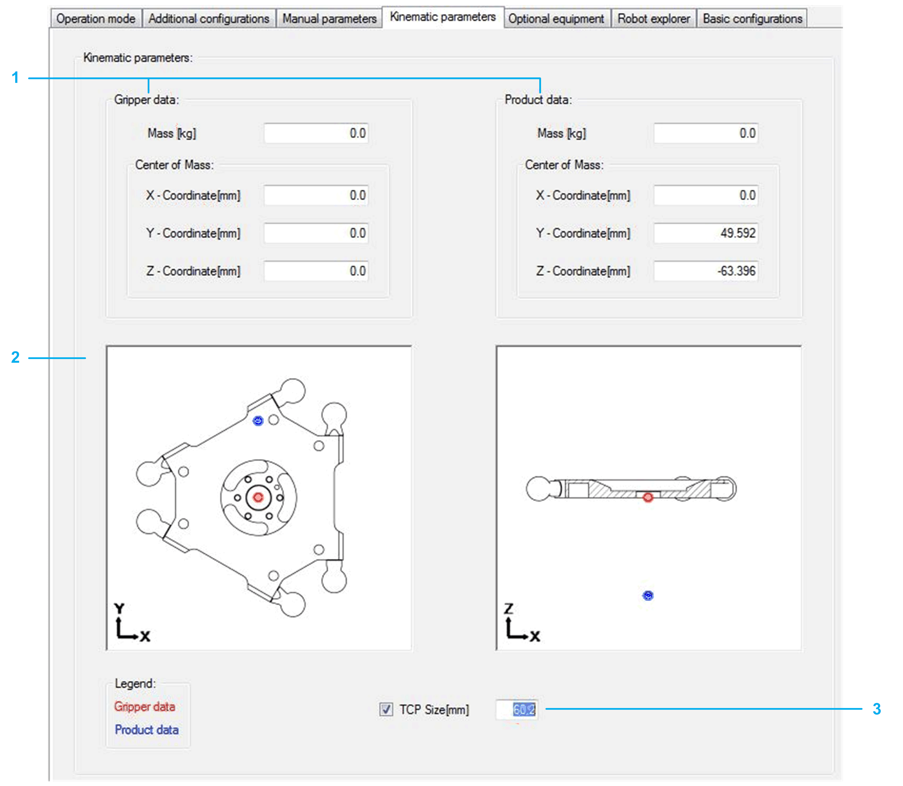

# Kinematic Parameters

## Overview

|  |  |
| --- | --- |
| 1 | Gripper data and Product data  The Center of Mass can be used if a payload (for example, a gripper) is mounted on the parallel plate asymmetrically and/or with a certain distance.  Detailed information can be found under: *[SetKinematicParameter](../../../../../api/crossBook?lang=en-US&virtualBookName=PD.Lib.SchneiderElectricRobotics&topicID=D_SE_0075199)* in SchneiderElectricRobotics Library Guide. |
| 2 | Parallel plate front view and top view:   * Red Point: displays the Center of Mass of the Gripper data * Blue Point: displays the Center of Mass of the Product data |
| 3 | TCP Size [mm]  You can modify the TCP plate size value:   * Default TCP plate size value: 50 mm. * Value range: 50...75 mm. * Activate the check box to use the value for code generation. |

EIO0000002369.12