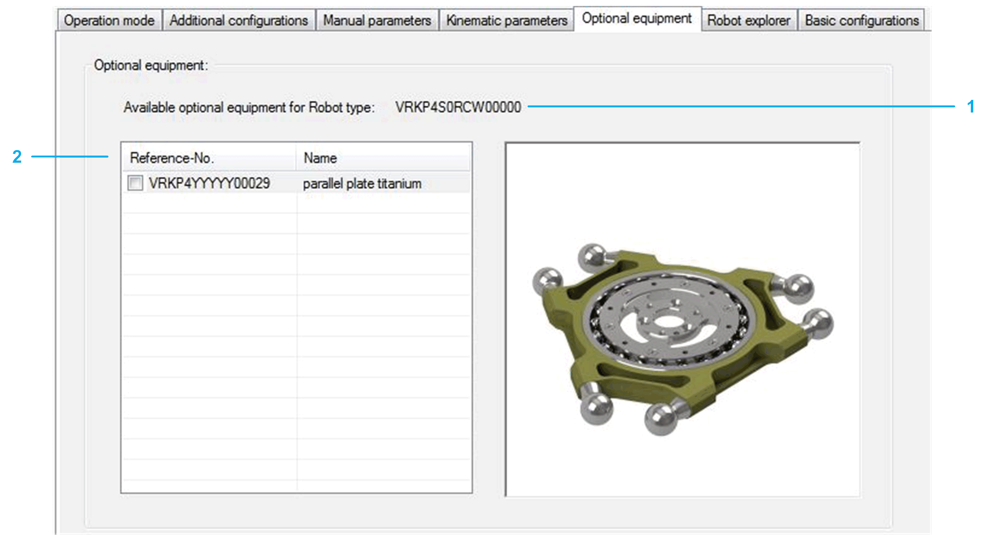

# Optional Equipment

## Overview

If optional equipment is mounted, it can be configured here:

|  |  |
| --- | --- |
| 1 | Displays the selected Robot Reference-No. |
| 2 | Select the optional equipment which is mounted at the robot.  Detailed information can be found under: *[ET\_OptionalEquipment](../../../../../api/crossBook?lang=en-US&virtualBookName=PD.Lib.SchneiderElectricRoboticsParameters&topicID=D_SE_0074965)* in SchneiderElectricRobotics Parameter Library Guide. |

EIO0000002369.12