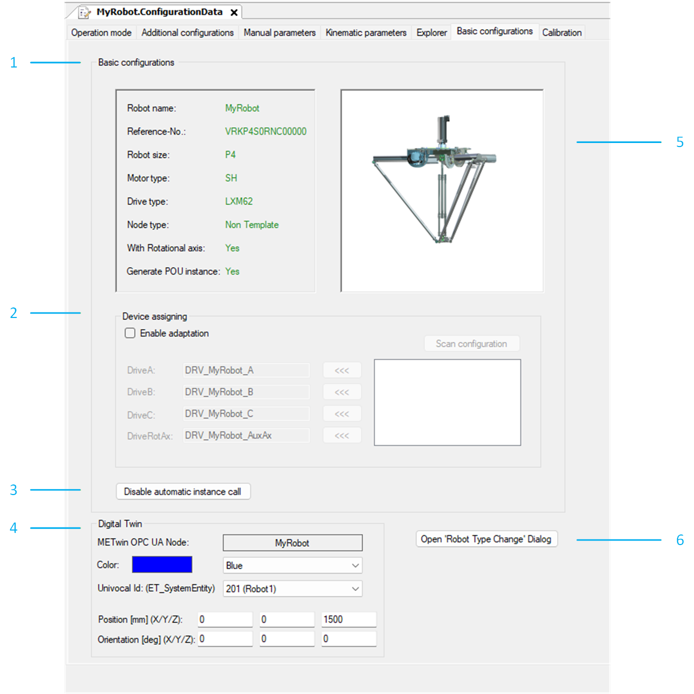

# Basic Configurations

## Overview

|  |  |
| --- | --- |
| 1 | Displays the data of the selected robot. |
| 2 | Device assigning: Assigns devices to modules. |
| 3 | Disables the automatic instance call. This button is only available when Node type  > Non Template is selected. |
| 4 | Digital Twin: Displays the node name of the robot which is used for communication and displayed in the EcoStruxure Machine Expert Twin. In addition, you can select the color used in the EcoStruxure Machine Expert Twin to identify the robot. |
| 5 | Displays a graphic of the selected robot. |
| 6 | Open Robot Type Change Dialog: Opens the robot type change dialog box. |

## Device Assigning

To assign a device to a module, proceed as follows:

| Step | Action |
| --- | --- |
| 1 | Activate the check box Enable adaptation. |
| 2 | Click the Start Sercos scan button. |
| 3 | Select a device in the box below the Start Sercos scan button. |
| 4 | Assign the selected device to a module by clicking the <<< button beside the respective drive. |

## Open Robot Type Change Dialog Box

To change the robot type, proceed as follows:

| Step | Action |
| --- | --- |
| 1 | Click the Open Robot Type Change Dialog button.  **Result:** An additional dialog box opens next to the current dialog box to compare the previous settings with the new settings. |
| 2 | Select the new Robot type.  You can use the filter Robot size, Motor type, Drive type (if configuration is possible) and Rotational axis to find the Robot type. |
| 3 | Click Start Robot Type Change > Yes.  **Result:** The configuration is processed with the new parameters.  When the changes are successfully completed, the Robot ‘Type Change‘ Feature dialog box opens with the request to proceed a ‘Clean All’ and ’Rebuild All’. Confirm with Ok. |

For detailed information on robot type change configuration, refer to [How to Change Robot Types](HowToChangeP-SeriesTypes-E0500004.html#HowToChangeP-SeriesTypes-E0500004).

EIO0000002369.12