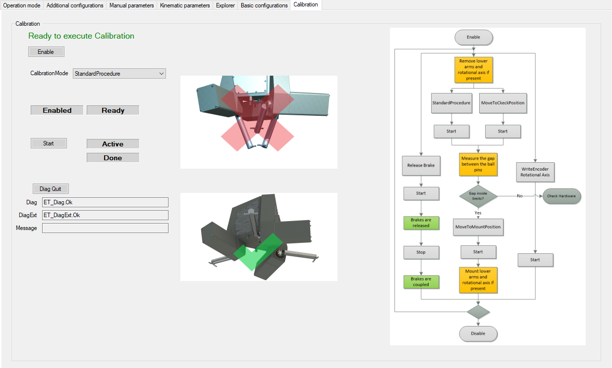
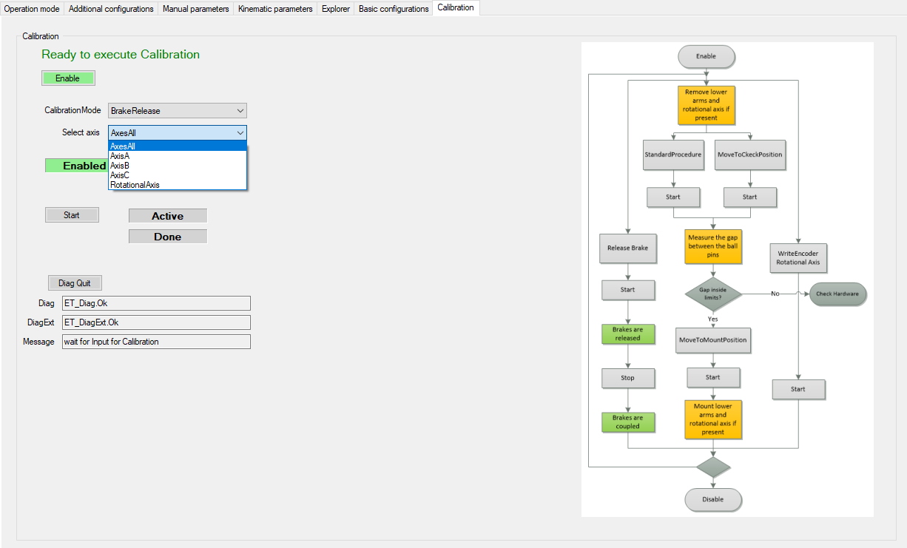
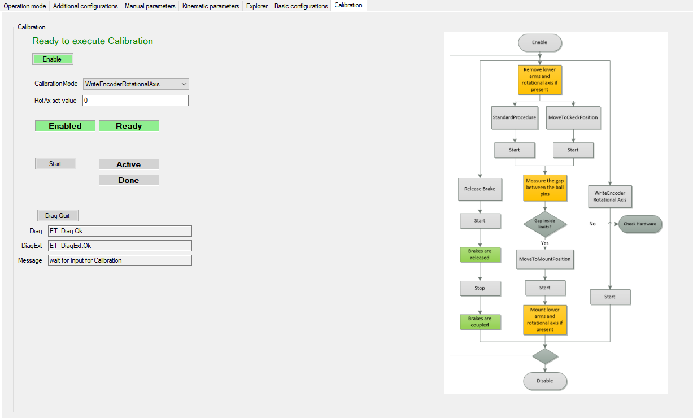

# Calibration

## Overview

In calibration mode, you can select different calibration procedures:

* StandardProcedure
* MoveToCheckPos
* MoveToMountPos
* BrakeRelease
* WriteEncoder RotationalAxis

## Remove Lower Arms and Rotational Axis

| Option | Procedure |
| --- | --- |
| StandardProcedure | NOTE: Before starting the Standard procedure move the robot to the specified position (green checkmark).  Select:   1. Calibration Mode > StandardProcedure 2. Start 3. Reset Start |
| MoveToCheckPosition | Select:   1. Calibration Mode > MoveToCheckPosition  NOTE: When the robot has moved to check position, verify the gap between the ball pins and verify if the value is inside the valid range (*[Calibrating the Main Axes](../../../../../api/crossBook?lang=en-US&virtualBookName=LXMPHG&topicID=D_SE_0059494)*). 2. Reset Start |
| MovetoMountPosition | Select:   1. Calibration Mode > MovetoMountPosition 2. Start 3. Reset Start |

## Brake Release

To release the brakes select:

1. Calibration Mode > BrakeRelease
2. Select axis

   * Axes All
   * AxisA
   * AxisB
   * AxisC
   * RotationalAxis
3. Start

   **Result:** The brakes of the selected axis are released.
4. Reset Start

   **Result:** The brakes of the selected axis are coupled.

## Write Encoder Rotational Axis

To calibrate the rotational axis select:

1. Calibration Mode > WriteEncoder RotationalAxis
2. Start

   **Result:** The rotational axis is calibrated. The selected value is written to the encoder of the rotational axis.

EIO0000002369.12