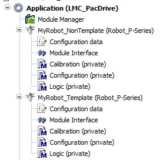
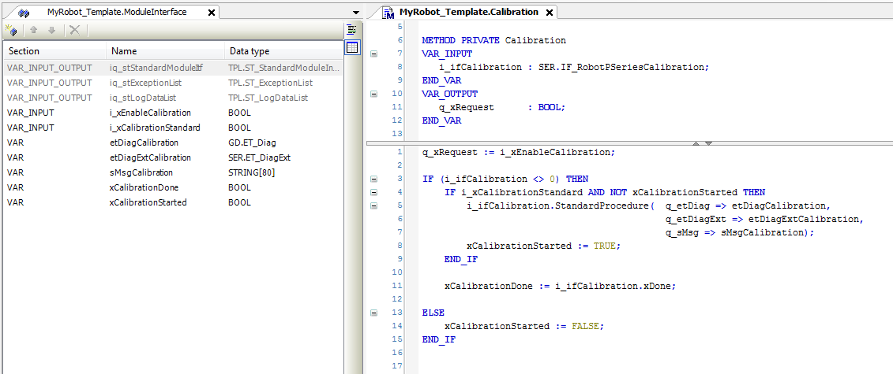
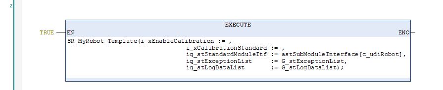

# Calibration / Configuration / Logic Method and ModuleInterface

## Overview

A robot needs two methods to be programmed: Calibration and Logic.

## Calibration

With the method Calibration, you can add code to calibrate a robot. Calibration is necessary if, for example, a motor or gearbox was replaced.

NOTE: You can use the function block *[SER.FB\_CalibrationPSeries](../../../../../api/crossBook?lang=en-US&virtualBookName=PD.Lib.SchneiderElectricRobotics&topicID=FB_Calibration_D16065FE)* to execute the calibration.

The method Calibration has an input (i\_ifCalibration: *[SER.IF\_RobotPSeriesCalibration](../../../../../api/crossBook?lang=en-US&virtualBookName=PD.Lib.SchneiderElectricRobotics&topicID=D_SE_0075220)*) and an output (q\_xRequest).

* If you want to execute a calibration, the output q\_xRequest has to be set to TRUE and has to remain TRUE during calibration.

  With setting q\_xRequest to TRUE, the robot is disabled so that the robot does not use the drives.
* If the robot is disabled, the i\_ifCalibration is validated, and you can use i\_ifCalibration to execute a calibration.

  i\_ifCalibration.xDone gives feedback if calibration is finished.

If you add variables to methods, these variables are volatile variables and are reinitialized with every call of the method. If you need variables that save their data, refer to [Data Exchange with ModuleInterface\Save Data](D-SE-0080567.html#D-SE-0080567__D-SE-0080567.6).

If you need variables to control your code, refer to [Data Exchange with ModuleInterface](D-SE-0080567.html#D-SE-0080567).

**Calibration method example:**

ModuleInterface (left side):

* i\_xEnableCalibration and i\_xCalibrationStandard are input variables created to control calibration. Refer to [Data Exchange with ModuleInterface](D-SE-0080567.html#D-SE-0080567).
* etDiagCalibration, etDiagExtCalibration, sMsgCalibration, xCalibrationDone, and xCalibrationStarted are variables, for example, to read present state. Refer to [Data Exchange with ModuleInterface\Save Data](D-SE-0080567.html#D-SE-0080567__D-SE-0080567.6).

Calibration method (right side):

* Use the variables, created in ModuleInterface, in the method Calibration.
* Verify that i\_ifCalibration is valid before using it. (For example, line 3 of implementation of method Calibration: `IF (i_ifCalibration <> 0) THEN`).
* A method to start calibration (for example StandardProcedure) must only be called once, not cyclically. (Line 4 to 9 of implementation of method Calibration).
* i\_ifCalibration.xDone gives feedback if calibration has been executed. For further information on calibration, refer to SchneiderElectricRobotics Library Guide.
* Update your call of the robot. (Add i\_xEnableCalibration and i\_xCalibrationStandard to the call of the robot).

  If you use the code generation option for Non Template robots, the call of the robot is updated automatically.

To start this calibration example, you must set the inputs i\_xEnableCalibration and i\_xCalibrationStandard to TRUE. i\_xEnableCalibration must be set to TRUE during calibration.

## Configuration

You can use the method Configuration for additional configuration, for example, to add a tracking system. This method is called once before ConfigDone.

## Logic

With the method Logic, you can add code, for example, to support robot motion.

The method Logic has an input (i\_etRotationalAxis) and an input/output (iq\_stRoboticModuleItf).

* The input i\_etRotationalAxis provides information which robot component (AuxAx) is used as rotational axis (if you have configured a robot with rotational axis).

  Otherwise it is 0 (ROB.ET\_RobotComponent.None). This information is necessary, for example, for a IF\_Motion.MoveSync or a IF\_RobotMotion.MoveAsync command.
* With the input/output (iq\_stRoboticModuleItf) you access, for example, IF\_RobotMotion to set move commands or to IF\_RobotFeedback to receive information of the status of the robot.

  If you want to use variables of IF\_RobotFeedback outside of the Logic method (for example for a trace), you can add a variable of type ROB.IF\_RobotFeedback to the ModuleInterface and copy iq\_stRoboticModuleItf.iq\_ifFeedback of Logic to the new variable.

Verify that interface is valid before using it (for example iq\_stRoboticModuleItf.iq\_ifFeedback <> 0).

If you add variables to methods, these variables are volatile variables and are reinitialized with every call of the method. If you need variables that save their data, refer to [Data Exchange with ModuleInterface\Save Data](D-SE-0080567.html#D-SE-0080567__D-SE-0080567.6).

If you need variables to control your code, refer to [Data Exchange with ModuleInterface](D-SE-0080567.html#D-SE-0080567).

EIO0000002369.12