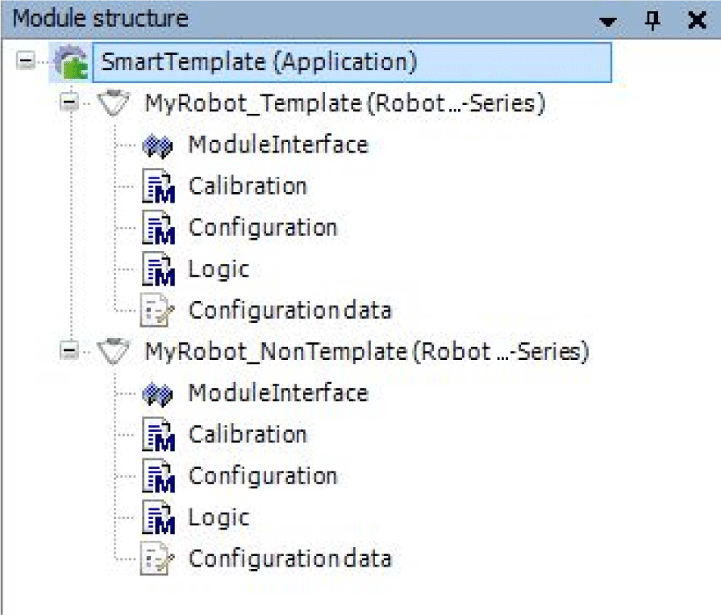

# SR\_<Robot T-Series Name> - General Information

## Overview

|  |  |
| --- | --- |
| Type: | Program |
| Available as of: | V1.3.1.0 |

This chapter provides information on:

* [Functional Description](#D-SE-0080394__D-SE-0080394.3)
* [Interface in Case of Node Type 'PacDrive 3 Template'](#D-SE-0080394__D-SE-0080394.25)
* [Interface in Case of Node Type 'Non Template'](#D-SE-0080394__D-SE-0080394.4)
* [Properties](#D-SE-0080394__D-SE-0080394.26)
* [Methods](#D-SE-0080394__D-SE-0080394.6)

## Functional Description

Smart Template Robot T-Series Module.

## Interface in Case of Node Type 'PacDrive 3 Template'

| Input/Output | Data type | Description |
| --- | --- | --- |
| iq\_stStandardModuleItf | TPL.ST\_StandardModuleInterface | Standard module interface (see ST\_StandardModuleInterface). |
| iq\_stExceptionList | TPL.ST\_ExceptionList | Exception List (see ST\_ExceptionList). |
| iq\_stLogDataList | TPL.ST\_LogDataList | Log Data List (see ST\_LogDataList). |
| iq\_stRobotModuleInterface | RM.ST\_ModuleInterface | RoboticModule specific parameters (see ST\_ModuleInterface). |
| q\_ifRobotFeedback | ROB.IF\_RobotFeedback | Robot feedback interface (see IF\_RobotFeedback). |

## Interface in Case of Node Type 'Non Template'

| Input | Data type | Description |
| --- | --- | --- |
| i\_xEnable | BOOL | A rising edge FALSE -> TRUE activates the POU, a falling edge TRUE -> FALSE deactivates the POU.  A deactivated POU does not execute any action. |
| i\_xAsyncStop | BOOL | Initiate an immediate asynchronous stop. The process can no longer be accessed while the exception is pending. No commands can be executed while the reaction is pending. You may still execute certain special operating modes and commands required for exception elimination. |
| i\_xSyncStopEL | BOOL | Initiate a synchronous stop (monitored by a timeout = waits until the robot path movement stops). Deactivates the process after the synchronous stop has been completed. The process can no longer be accessed while the exception is pending. If the timeout (configurable) is triggered, the function transitions to an asynchronous stop. |
| i\_xSyncStopEH | BOOL | Initiate a synchronous stop (monitored by a timeout = waits until the robot path movement stops). Does NOT disable process after completion of the synchronous stop. |
| i\_xStopEndOfCycle | BOOL | Initiate a stop at the end of the cycle. Does NOT deactivate the process. |
| i\_xDiagQuit | BOOL | A rising edge FALSE -> TRUE cancels an active exception of the POU. |

| Output | Data type | Description |
| --- | --- | --- |
| q\_xActive | BOOL | TRUE: The POU is active. If the output is TRUE while the i\_xEnable is deactivated, the POU must first terminate its ongoing processing before transitioning this output to FALSE.  FALSE: The POU is inactive |
| q\_xReady | BOOL | TRUE: The POU is ready to operate and can accept user commands.  FALSE: The function block is not ready to accept user commands. |
| q\_etDiag | *[GD.ET\_Diag](../../../../../api/crossBook?lang=en-US&virtualBookName=PD.Lib.GlobalDiagnostic&topicID=D_SE_0076228)* | General library-independent statement on the diagnostic. A value unequal to GD.ET\_Diag.Ok corresponds to a diagnostic message. |
| q\_udiDiagExt | UDINT | POU-specific output on the diagnostic.  q\_etDiag = GD.ET\_Diag.Ok -> Status message  q\_etDiag <> GD.ET\_Diag.Ok -> Diagnostic message |
| q\_sDiagExt | STRING[80] | The name of the respective enumeration of q\_udiDiagExt as Description. |
| q\_sMsg | STRING[80] | Event-triggered message that gives more detailed information on the diagnostic state. |
| q\_xException | BOOL | An error was detected and an exception is active. |
| q\_xWarning | BOOL | An advisory is active. |
| q\_etActiveOpMode | RM.ET\_OpMode | The active operating mode of the Smart Template robot module. |
| q\_xCmdActive | BOOL | A command is active. |
| q\_etCmdActive | RM.ET\_Cmd | The active command of the Smart Template robot module. |
| q\_xCmdDone | BOOL | A command is terminated successfully. |
| q\_xAsyncStop | BOOL | An immediate asynchronous stop is active. The process can no longer be accessed while the exception is pending. No commands can be executed while the reaction is pending. You may still execute certain special operating modes and commands required for exception elimination. |
| q\_xSyncStopEL | BOOL | A synchronous stop (monitored by a timeout = waits until the robot path movement stops) is active. Deactivates the process after the synchronous stop has been completed. The process can no longer be accessed while the exception is pending. If the timeout (configurable) is triggered, the function transitions to an asynchronous stop. |
| q\_xSyncStopEH | BOOL | A synchronous stop (monitored by a timeout = waits until the robot path movement stops) is active. Does NOT disable process after completion of the synchronous stop. |
| q\_xStopEndOfCycle | BOOL | A stop at the end of the cycle is active. Does NOT deactivate the process. |
| q\_ifRobotFeedback | ROB.IF\_RobotFeedback | Robot feedback interface (see IF\_RobotFeedback). |

| Input/Output | Data type | Description |
| --- | --- | --- |
| iq\_etCmd | RM.ET\_Cmd | Transfer a module command to the module. |
| iq\_stRobotModuleInterface | RM.ST\_ModuleInterface | RoboticModule specific parameters (see ST\_ModuleInterface). |

## Properties

| Name | Data type | Accessing | Description |
| --- | --- | --- | --- |
| etSystemId | SERT.ET\_SystemEntity | Read | Read the configured System ID of the module. |
| ifCollisionHandlerTSeries | SER.IF\_CollisionHandlerTSeries | Read | The interface provides methods to configure and use a collision handler for a Lexium T Robot. |
| ifTSeriesFeedback | SER.IF\_RobotTSeriesFeedback | Get | Get the interface to read feedback data of a Lexium T Robot. |
| ifRobotFeedback | ROB.IF\_RobotFeedback | Get | Get the interface to read feedback data of the robot. |
| ifRobotTSeries | SER.IF\_RobotTSeries | Get | Get the interface to have access to the methods and properties of FB\_RobotTSeries. |
| xBrakeReleaseAxisNoOp | BOOL | Get/Set | TRUE: The brakes of the axis will be released if the robot is in no specific operation mode (for example, Manual, Auto)  FALSE: The brakes of the axis will be closed if the robot is in no specific operation mode (for example Manual, Auto) |
| xDisableWorkEnvelopeMoveCmds | BOOL | Read/write | TRUE: Disable the verification of target, circular, and spline points when sending move commands to the robot.  Default value: FALSE  In case of xDisableWorkEnvelopeMoveCmds activated and the robot is outside the work envelope, the robot accepts the move commands and returns ET\_Diag = Ok. The robot starts the movement but will immediately stop. |
| xInitDone | BOOL | Read | TRUE: The initialization is successful.  FALSE: The initialization is not done.  NOTE: xInitDone is set to TRUE when the initialization part of the module is called and the method Configuration is called before calling the method Logic for the first time. |

## Methods

| Name | Description |
| --- | --- |
| [Calibration](D-SE-0080400.html) | Execute the calibration for a Lexium T Robot. |
| [Configuration](D-SE-0080402.html) | Configure additional features (for example tracking). |
| [GetControlLoopParameter](D-SE-0081091.html) | Read the parameter which influences the control loop of the Lexium T Robot axes. |
| [GetDigitalTwinConfigData](TPC_SmrtTSer_Meth_GetDigitalTwinConfigData_SR_Robot_T.html) | Read the configuration data for the OPC/UA data structure of the Lexium T Robot. |
| [GetKinematicParameter](D-SE-0081095.html) | Read kinematic parameter for a Lexium T Robot. |
| [GetRobotData](TPC_SmrtTSer_Meth_GetRobotData_SR_Robot_T.html) | Read the parameters of the configured robot |
| [Logic](D-SE-0080544.html) | Logic for the Lexium T Robot (for example motion logic). |
| [RegisterLoggerPoint](D-SE-0080545.html) | Register the Smart Template Robot T-Series Module to the Application Logger. |
| [SetControlLoopParameter](D-SE-0080549.html) | Set parameter to influence the control loop of the Lexium T Robot axes. |
| [SetKinematicParameter](D-SE-0081105.html) | Set kinematic parameter for a Lexium T Robot. |

EIO0000002598.10