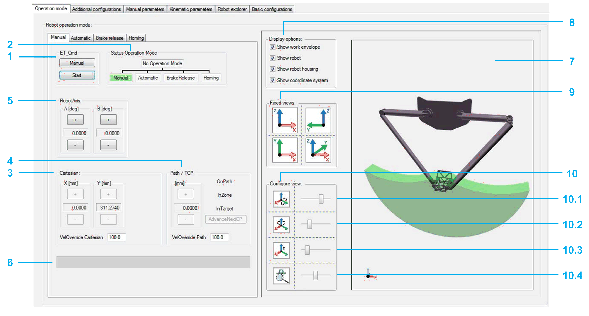
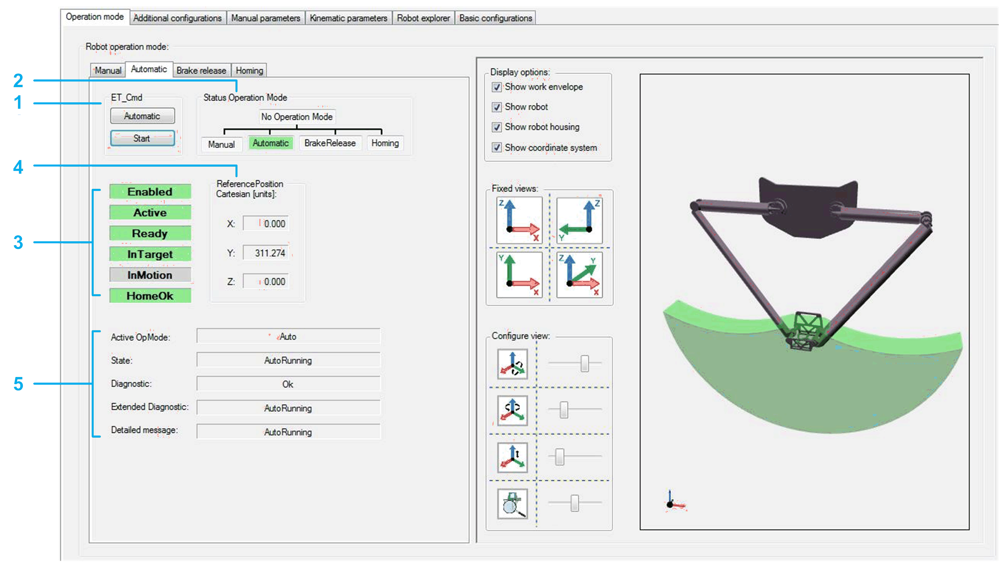
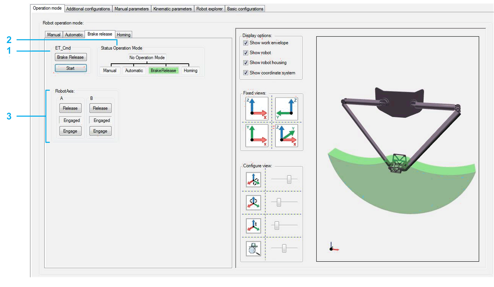
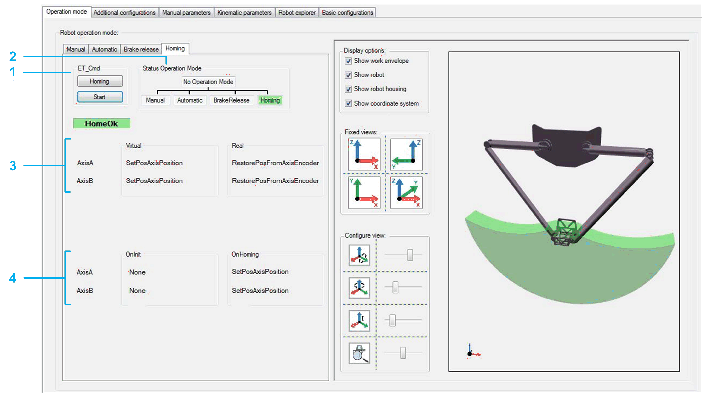

# Operation Mode

## Overview

Refer to the [*Smart Template Modules User Guide*](../../../../../api/crossBook?lang=en-US&virtualBookName=SmrtTplt&topicID=D_SE_0091270) for more information on displaying the different tabs.

The Operation mode tab provides a tab for each operation mode on the left-hand side:

* Manual
* Automatic
* Brake release
* Homing

On the right-hand side, the Operation mode tab displays a visualization of the robot. The visualization can be configured (Display options and Views).

## Manual Tab

* The left-hand side of the Manual tab helps you to move the robot manually.
* The right-hand side of the Manual tab displays the robot movements in a 3D visualization. The visualization can be configured (Display options and Views).

| WARNING | |
| --- | --- |
|  | UNINTENDED MOVEMENT OF THE AXIS  * Ensure the proper functioning of the functional safety equipment before commissioning. * Ensure that you can stop axis movements at any time using functional safety equipment (limit switch, emergency stop) before and during commissioning.  Failure to follow these instructions can result in death, serious injury, or equipment damage. |

NOTE: If the robot application is offline or the robot module is not called within the application, the controls of the Manual tab are disabled.

Moving the robot manually:

|  |  |
| --- | --- |
| 1 | ET\_Cmd  If the module is not in the operation mode Manual, click the Manual button to send the command RM.ET\_Cmd.Manual, and then click the Start button to send the command RM.ET\_Cmd.Start.  NOTE: Alternatively you can send the commands via the [ModuleInterface](D-SE-0080567.html#D-SE-0080567) (for example, iq\_etCmd).  If the Manual operation mode is accepted, the background color of the operation mode status Manual switches to green. |
| 2 | Status Operation Mode  Displays the operation mode of the module.  If the robot is in Manual operation mode, you can move the robot step-by-step with the buttons of the various jogging modes:   * Jogging along the Cartesian coordinate system (Cartesian) * TCP (Tool Center Point) jogging on path (Path / TCP) * Jogging along the robot axes by controlling the corresponding drives (Robot Axis) |
| 3 | Cartesian  Click the buttons (positive / negative) to move (jog) the TCP (Tool Center Point) along the axes of the Cartesian coordinate system.  The displayed cartesian parameters depend on the configuration of *[ET\_WorkingPlane](../../../../../api/crossBook?lang=en-US&virtualBookName=PD.Lib.Robotic&topicID=D_SE_0075495)* (refer to Robotic Library Guide).  VelOverride Cartesian: Proportional influence of the active Cartesian jogging velocity. Unit: % |
| 4 | Path / TCP  Click the buttons (positive / negative) to move (jog) the TCP (Tool Center Point) along a connected path (if a connected path is available).  For status information on the TCP movement, refer to the feedback properties *[xOnPath](../../../../../api/crossBook?lang=en-US&virtualBookName=PD.Lib.Robotic&topicID=D_SE_0075539)*, xInZone, and xInTarget (refer to Robotic Library Guide).  VelOverride Path: Proportional influence of the active path jogging velocity. Unit: %. |
| 5 | Robot Axis  Click the buttons (positive / negative) to move (jog) along the robot axes by controlling the corresponding drives. |
| 6 | List box  Displays the pending hardware and software limits. |

Configuring the visualization:

|  |  |
| --- | --- |
| 7 | Robot 3D visualization  Shows the movement of the robot, particularly the TCP (Tool Center Point) movement within the working plane. |
| 8 | Display options  Activate the check boxes to define what is displayed in the Robot 3D visualization (work envelope, robot, robot housing, coordinate system). |
| 9 | Fixed views  Click one of the four buttons to select a fixed default view of the robot. |
| 10 | Configure view  Move the sliders to configure the rotation, translation, and zoom of the displayed robot.  10.1 Rotation around Y-axis  10.2 Rotation around Z-axis  10.3 Translation in direction of Z-axis  10.4 Zoom |

## Automatic Tab

* The left-hand side of the Automatic tab provides feedback and diagnostic information on the robot.
* The right-hand side of the Automatic tab displays the robot movements in a 3D visualization. The visualization can be configured (refer to Manual Tab above).

|  |  |
| --- | --- |
| 1 | ET\_Cmd  If the module is not in the operation mode Automatic, click the Automatic button to send the command RM.ET\_Cmd.Auto, and then click the Start button to send the command RM.ET\_Cmd.Start.  NOTE: Alternatively you can send the commands via the [ModuleInterface](D-SE-0080567.html#D-SE-0080567) (for example, iq\_etCmd).  If the Automatic operation mode is accepted, the background color of the operation mode status Automatic switches to green. |
| 2 | Status Operation Mode  Displays the operation mode of the module. |
| 3 | Feedback   * Enabled  A green background color indicates that the module is enabled. * Active  Detailed information can be found under: *[ST\_ModuleInterface.q\_xRobotActive](../../../../../api/crossBook?lang=en-US&virtualBookName=PD.Lib.RoboticModule&topicID=D_SE_0076969)* in RoboticModule Library Guide. * Ready  Detailed information can be found under: *[ST\_ModuleInterface.q\_xRobotReady](../../../../../api/crossBook?lang=en-US&virtualBookName=PD.Lib.RoboticModule&topicID=D_SE_0076969)*  in RoboticModule Library Guide. * InTarget  Detailed information can be found under: *[IF\_RobotFeedback.xInTarget](../../../../../api/crossBook?lang=en-US&virtualBookName=PD.Lib.Robotic&topicID=D_SE_0075539)* in Robotic Library Guide. * InMotion  Detailed information can be found under: *[IF\_RobotFeedback.xInMotion](../../../../../api/crossBook?lang=en-US&virtualBookName=PD.Lib.Robotic&topicID=D_SE_0075539)* in Robotic Library Guide. * HomeOK  Detailed information can be found under: *[ST\_ModuleInterface.q\_xHomeOk](../../../../../api/crossBook?lang=en-US&virtualBookName=PD.Lib.RoboticModule&topicID=D_SE_0076969)* in RoboticModule Library Guide. |
| 4 | Reference Position Cartesian  The displayed Cartesian parameters depend on the configured working plane.  Detailed information can be found under: *[IF\_RobotFeedback.rstRefPositionTCP](../../../../../api/crossBook?lang=en-US&virtualBookName=PD.Lib.Robotic&topicID=D_SE_0075539)* in Robotic Library Guide. |
| 5 | Diagnostic  Diagnostics of the robot module. Detailed information can be found under: *[ET\_DiagExt](../../../../../api/crossBook?lang=en-US&virtualBookName=PD.Lib.RoboticModule&topicID=D_SE_0076888)* in RoboticModule Library Guide. |

## Brake Release Tab

* The left-hand side of the Brake release tab helps you to release/engage the brake(s) of one or several robot axes.
* The right-hand side of the Brake release tab displays the robot movements in a 3D visualization. The visualization can be configured (refer to Manual Tab above).

|  |  |
| --- | --- |
| 1 | ET\_Cmd  If the module is not in the operation mode BrakeRelease, click the Brake Release button to send the command RM.ET\_Cmd.BrakeRelease, and then click the Start button to send the command RM.ET\_Cmd.Start.  NOTE: Alternatively you can send the commands via the [ModuleInterface](D-SE-0080567.html#D-SE-0080567) (for example, iq\_etCmd).  If the BrakeRelease operation mode is accepted, the background color of the operation mode status BrakeRelease switches to green. |
| 2 | Status Operation Mode  Displays the operation mode of the module. |
| 3 | RobotAxis   * Click the Release button to release the brake of the respective axis. * Click the Engage button to engage the brake of the respective axis.   The indicator between the Release and the Engage button displays the state of the respective brake. |

## Homing Tab

* The left-hand side of the Homing tab displays the homing mode of the robot axes.
* The right-hand side of the Homing tab displays the robot movements in a 3D visualization. The visualization can be configured (refer to Manual Tab above).

|  |  |
| --- | --- |
| 1 | ET\_Cmd  If the module is not in the operation mode Homing, click the Homing button to send the command RM.ET\_Cmd.Homing, and then click the Start button to send the command RM.ET\_Cmd.Start.  NOTE: Alternatively you can send the commands via the [ModuleInterface](D-SE-0080567.html#D-SE-0080567) (for example, iq\_etCmd).  If the Homing operation mode is accepted, the background color of the operation mode status Homing switches to green. |
| 2 | Status Operation Mode  Displays the operation mode of the module. |
| 3 | Virtual/Real  Displays the configured homing mode of the respective axis in case of working mode Virtual and working mode Real. |
| 4 | OnInit/OnHoming  Displays the present homing modes for homing OnInit and OnHoming. |

EIO0000002598.10