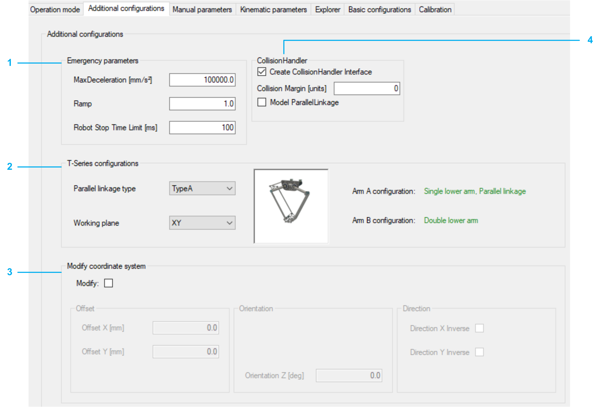

# Additional Configurations

## Overview

|  |  |
| --- | --- |
| 1 | Emergency parameters  The necessary data for an emergency stop must be configured.  Detailed information can be found under: *[SetEmergencyParameter](../../../../../api/crossBook?lang=en-US&virtualBookName=PD.Lib.RoboticModule&topicID=D_SE_0076929)* in RoboticModule Library Guide. |
| 2 | T-Series configurations  Parameters to configure the Parallel linkage type and the used Working plane.  Parallel linkage type: Type A or type B determines the drive with parallel linkage construction.  Type A:  Type B:  Detailed information can be found under: *[ET\_RobotTSeriesConfiguration](../../../../../api/crossBook?lang=en-US&virtualBookName=PD.Lib.SchneiderElectricRoboticsParameters&topicID=D_SE_0074971)* in SchneiderElectricRobotics Parameters Library Guide. |
| 3 | Modify coordinate system  The robot coordinate system can be modified. If the checkbox Modify is not set, the coordinate system is set to default values defined by the selected robot.  In case the robot is a submodule of RobotCell and orientation was modified in RobotCell, a button Compensate Orientation RobotCell is displayed. If you click the button the according values are overwritten.  NOTE: In case you have modified the orientation in RobotCell, a prompt reminds you to verify whether a compensation on Robot level is required.  Detailed information can be found under: *[ModifyCoordinateSystem2](../../../../../api/crossBook?lang=en-US&virtualBookName=PD.Lib.RoboticModule&topicID=T002816079)* in RoboticModule Library Guide.  The displayed Offset parameters depend on the configured Working plane.  Working plane XY:  Working plane XZ:  Working plane YZ:  Detailed information can be found under: *[IF\_Configuration.Cartesian2Ax](../../../../../api/crossBook?lang=en-US&virtualBookName=PD.Lib.RoboticModule&topicID=D_SE_0076919)* in RoboticModule Library Guide. |
| 4 | CollisionHandler  Select the checkbox Create CollisionHandler Interface to configure the collision handler. If the checkbox Create CollisionHandler Interface is selected, the Collision Margin value can be set.  The property SR\_<Robot\_T-Series\_Name>.ifCollisionHandlerTSeries is configured based on this configuration.  Detailed information can be found under: [*FB\_CollisionHandlerTSeries*](../../../../../api/crossBook?lang=en-US&virtualBookName=PD.Lib.SchneiderElectricRobotics&topicID=FB_CollisionHandlerTSeries_GeneralI_056330ED) in the SchneiderElectricRobotics Library Guide. |

EIO0000002598.10