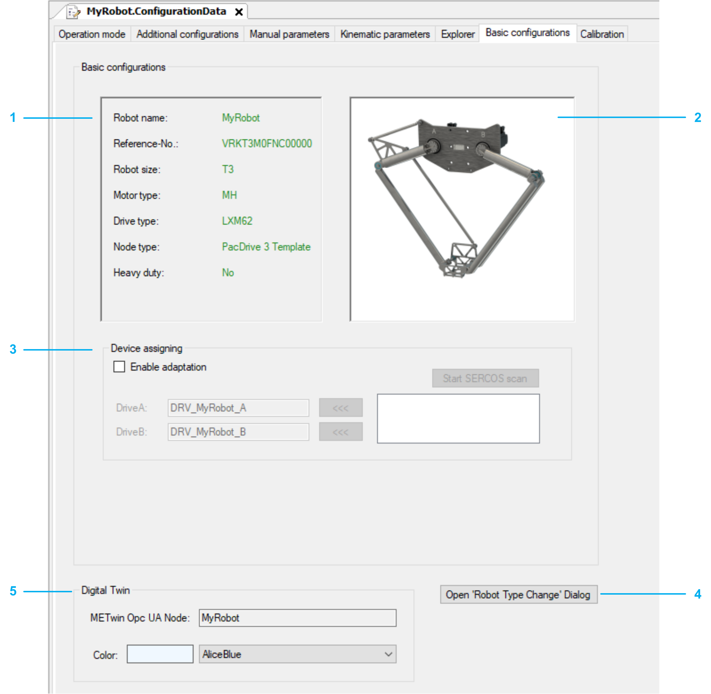

# Basic Configurations

## Overview

|  |  |
| --- | --- |
| 1 | Displays the data of the selected robot. |
| 2 | Displays a graphic of the selected robot. |
| 3 | Device assigning: Assigns devices to modules |
| 4 | Open Robot Type Change Dialog: Opens the robot type change dialog box. |
| 5 | Digital Twin: Displays the node name of the robot which is used for communication and displayed in the EcoStruxure Machine Expert Twin. In addition, you can select the color used in the EcoStruxure Machine Expert Twin to identify the robot. |

## Device Assigning

To assign a device to a module, proceed as follows:

| Step | Action |
| --- | --- |
| 1 | Activate the check box Enable adaptation. |
| 2 | Click the Start SERCOS scan button. |
| 3 | Select a device in the box below the Start SERCOS scan button. |
| 4 | Assign the selected device to a module by clicking the <<< button beside the respective module. |

## Open Robot Type Change Dialog Box

To change the robot type, proceed as follows:

| Step | Action |
| --- | --- |
| 1 | Click the Open Robot Type Change Dialog button.  **Result:** An additional dialog box opens next to the current dialog to compare the previous settings with the new settings. |
| 2 | Select the new robot type. You can use the filter Robot size, Motor type and Heavy Duty to find the robot type |
| 3 | Click Start Robot Type Change > Yes.  **Result:** The configuration is processed with the new parameters.  When the changes are successfully completed, the Robot ‘Type Change‘ Feature dialog box opens with the request to proceed a ‘Clean All’ and ’Rebuild All’. Confirm with Ok. |

For detailed information on robot type change configuration, refer to [How to Change Robot Types](HowToChangeRobotTypes-E0E42CCC.html).

EIO0000002598.10