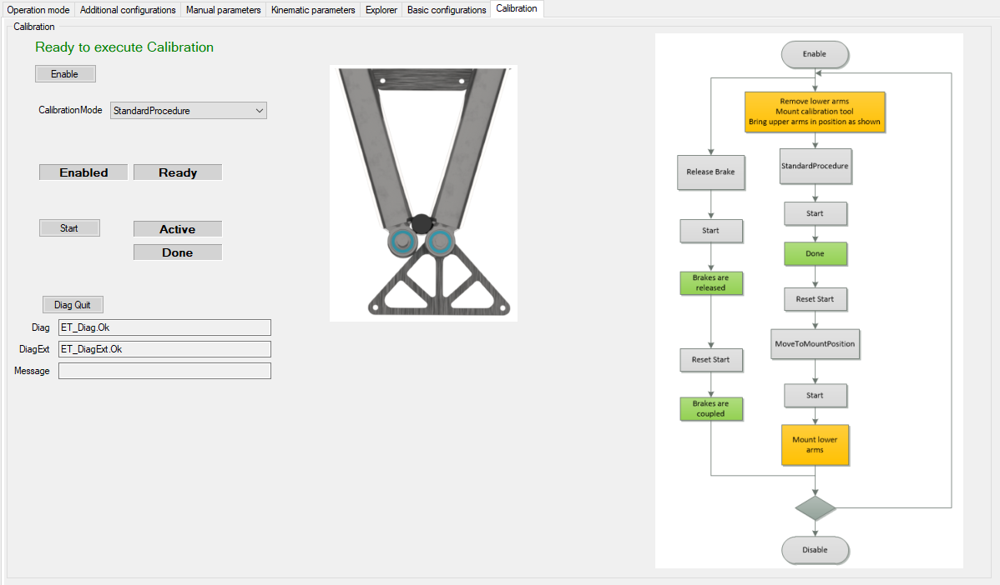
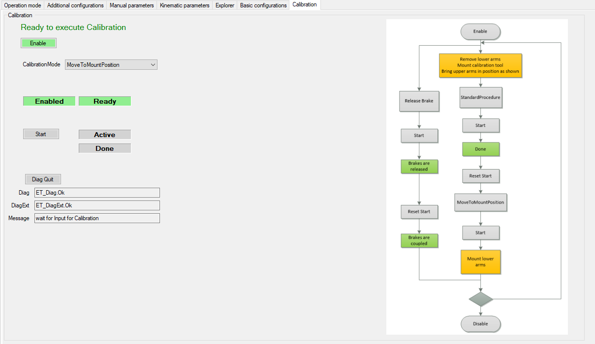
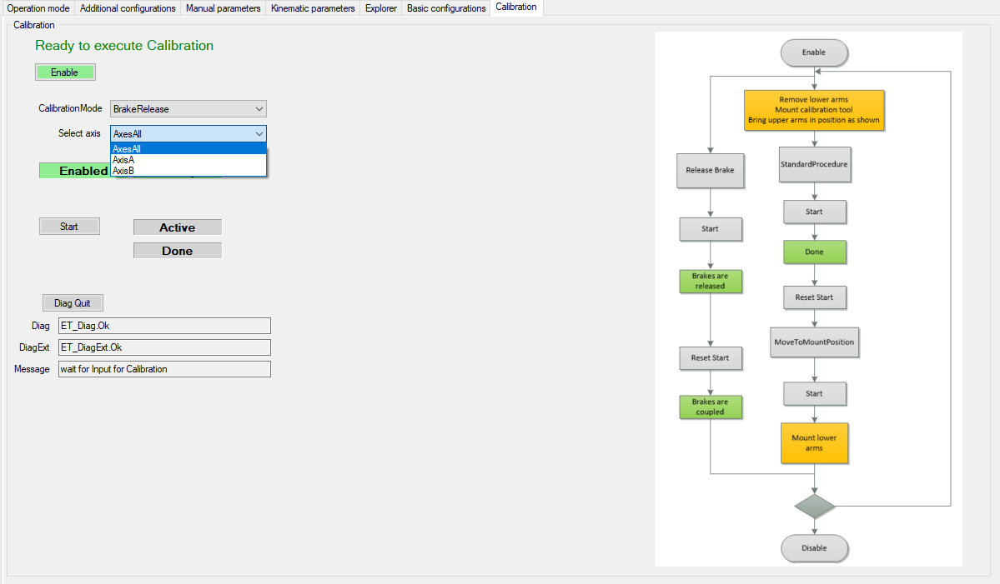

# Calibration

## Overview

In calibration mode you can select different calibration procedures:

* StandardProcedure
* BrakeRelease

## StandardProcedure

To start the StandardProcedure the robot must be in the displayed position.

NOTE: Remove lower arms, mount calibration tool, bring upper arm in position as shown in the picture. You can use the mode BrakeRelease to bring the robot arms in this position.

Select:

1. Calibration Mode > StandardProcedure
2. Start
3. Reset Start
4. Calibration Mode > MovetoMountPosition
5. Start

   **Result:** The robot moves to the specified position where the arms can be mounted.

## Brake Release

To release the brakes select:

1. Calibration Mode > BrakeRelease
2. Select axis

   * Axes All
   * AxisA
   * AxisB
3. Start

   **Result:** The brakes of the selected axis are released.
4. Reset Start

   **Result:** The brakes of the selected axis are coupled.

EIO0000002598.10