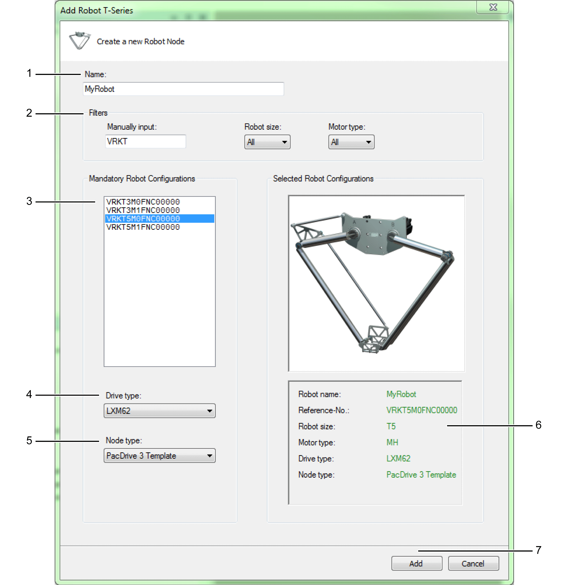

# Add Robot T-Series

## Dialog Box

| Step | Action |
| --- | --- |
| 1 | Select a Name for the robot (1). The created object and the created drives use this name. |
| 2 | Use the Filters to reduce the list of robot types (2):   * Manually input: Start typing the reference number (for example, VRKT3M) * Robot size: T3, T5 * Motor type: SH or ILM |
| 3 | Select robot using the Reference-No: (3). |
| 4 | Select Drive type: (4) Depending on the selected motor type select the corresponding drive type. |
| 5 | Select Node type: (5)   * PacDrive 3 Template: The generated robot is prepared to be used with the PacDrive 3 Template. * Non Template: The generated robot can be used in other EcoStruxure Machine Expert software architectures without PacDrive 3 Template. |
| 6 | Verify the robot configuration (6). You cannot modify the configuration after leaving this dialog box. |
| 7 | Confirm configuration (7). Use the Add button to add the configured robot to your project. |

EIO0000002598.10