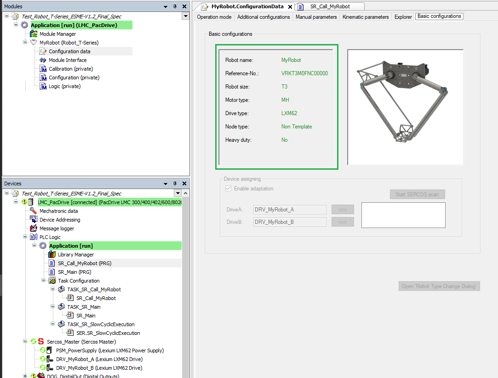
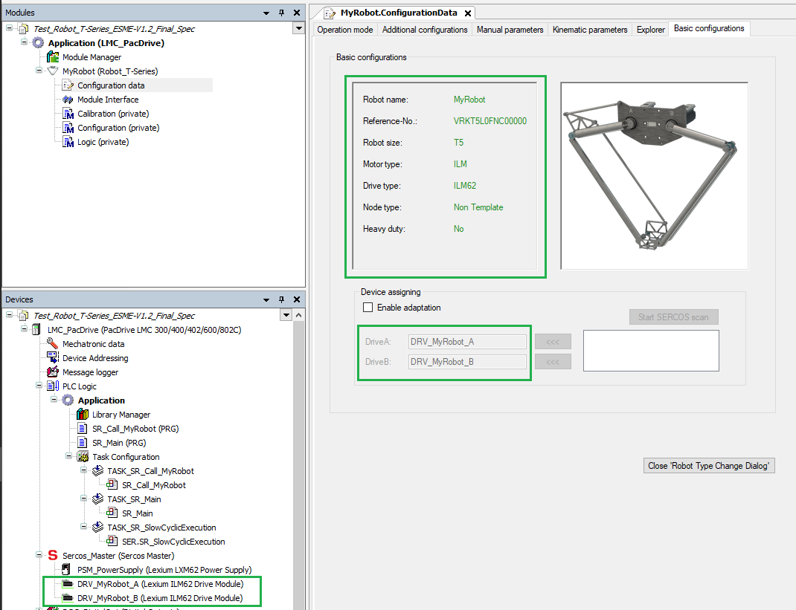

# How to Change Robot Types

## General

In this chapter a type change of a robot is shown as an example.

## Restrictions

Within the Robot Type Change Feature dialog box, it is not possible to change the following configured parameters / data:

* Robot name
* Node type
* Generate POU instance (option if node type is equal to Non-Template)

## Selecting the Robot Type

This example includes a T3 robot with the following basic configuration parameters as shown below:

The T3 robot should be changed to a T5 robot with the following configuration parameters:

* **VRKT3M0FNC00000:**T3, MH motor, LXM62 drive, No Heavy duty
* **VRKT5L0FNC00000:** T5, ILM motor, ILM62 drive, No Heavy duty

| Step | Action |
| --- | --- |
| 1 | Open the Robot Type Change dialog box. Select MyRobot.ConfiurationData >  Basic configurations and press the corresponding button. |
| 2 | Select the required robot with the help of the different filters.  **Result:** The new robot is displayed in the Change Robot Type dialog box. |

## Starting Robot Type Change

| Step | Action |
| --- | --- |
| 1 | Select ‘Start Robot Type Change’ > Yes.  NOTE: It will take few minutes to process all the changes.  NOTE: During the program execution, do not operate in other windows until the process is finished. |
| 2 | Press OK the ‘Robot Type Change’ Feature dialog box.  **Result:** The Basic configuration window will be updated with the new robot type. |

## Results of Type Change Procedure

The results of the type change procedure is shown in the updated Basic configurations tab:

The robot configuration changes are:

| Parameter | Before Type Change | After Type Change |
| --- | --- | --- |
| VRK Reference | VRKT3M0FNC00000 | VRKT5L0FNC00000 |
| Robot size | T3 | T5 |
| Motor type | MH | ILM |
| Drive type | LXM62 | ILM62 |
| Sercos devices tree | Drive types modified to Lexium ILM62. | |

NOTE: The Operation mode tab is also updated to the new robot type picture.

EIO0000002598.10