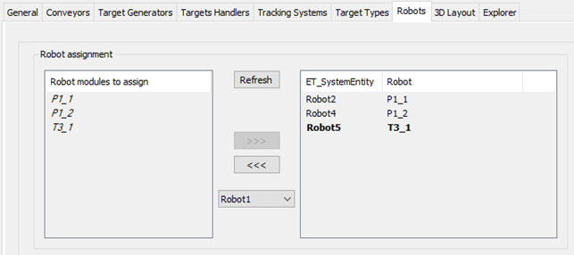
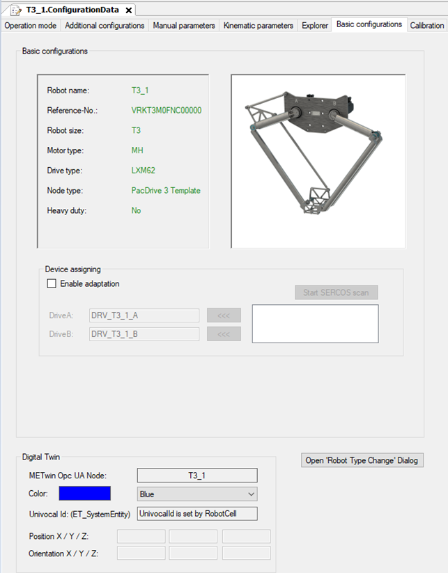
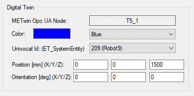

# Univocal ID for DigitalTwin

## Overview

If the T-Series module is a submodule of a RobotCell, the Univocal Id for DigitalTwin communication is set by the RobotCell ET\_SystemEntity value. See example T3\_1: ID ET\_SystemEntity.Robot5 Univocal Id is set to 205, which represents the value of SERT.ET\_SystemEntity.Robot5.

If a T-Series Module is not a submodule of a RobotCell, the Univocal Id can be selected from the drop-down list. Ensure that the Univocal Id is unique for the project and all modules used for DigitalTwin. You also must set the position and orientation.

EIO0000002598.10