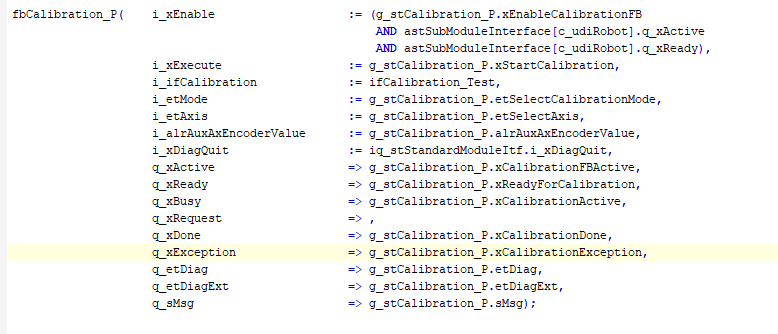

# Using the Function Block FB\_Calibration without SmartTemplate

To use the function block without the SmartTemplate, you must take care to disable the robot.

To disable the RoboticModule the input i\_xEnable must be set to FALSE.

```
IF xDisableRobot
	THEN
	astSubModuleInterface[c_uidRobot].i_xEnable	:= FALSE;
ELSE
	astSubModuleInterface[c_uidRobot].i_xEnable	:= FALSE;
END_IF
```

To ensure the RoboticModule is disabled you have to verify that the outputs q\_xActive and q\_xReady are set to FALSE.

You could ask these outputs as additional variables to enable the calibration.



After the calibration is finished, you must enable the RoboticModule again by setting the input i\_xEnable to TRUE.

EIO0000002598.10