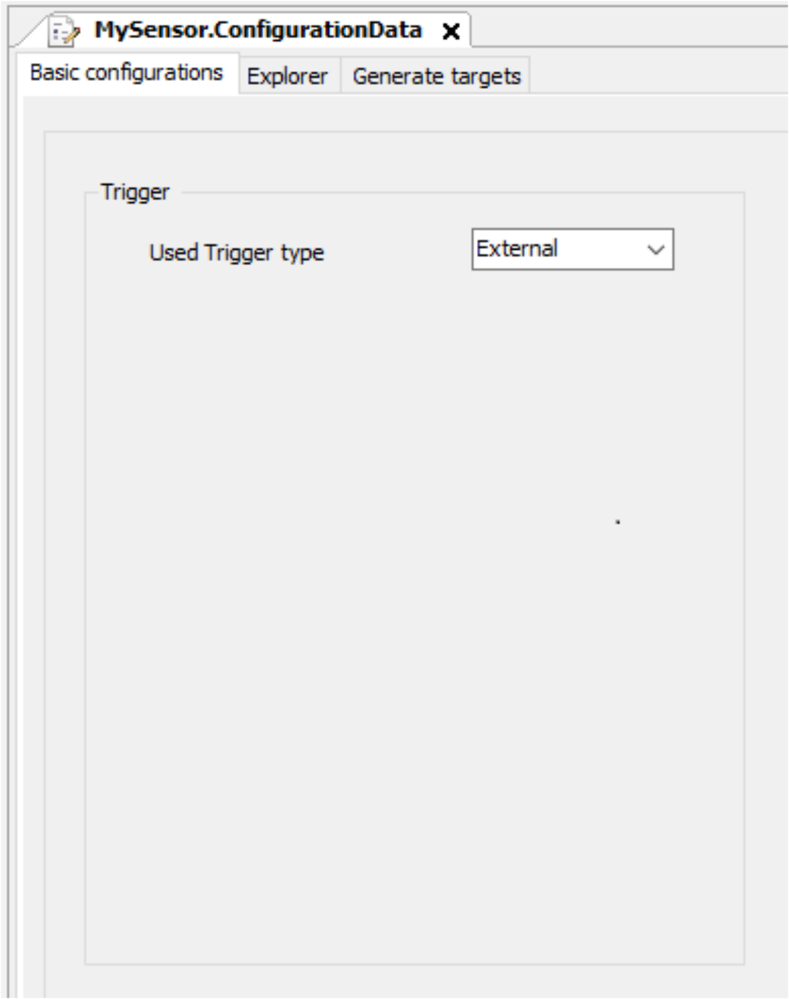
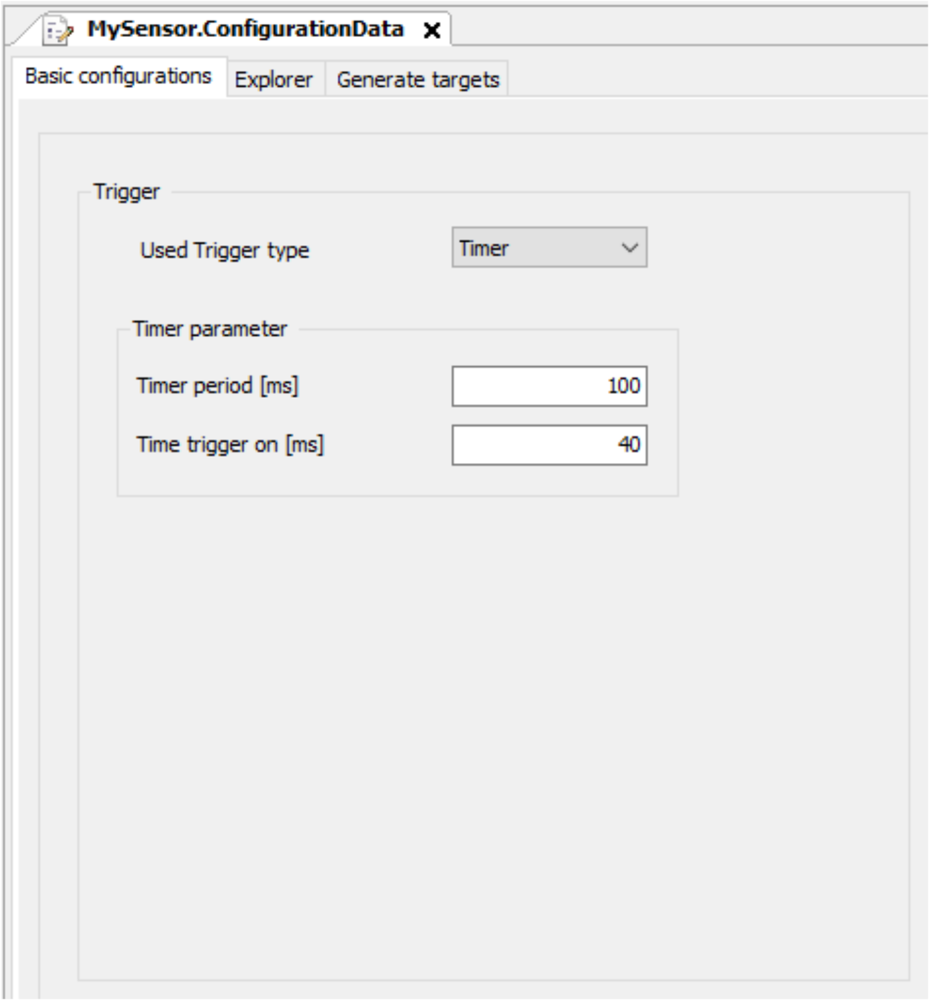
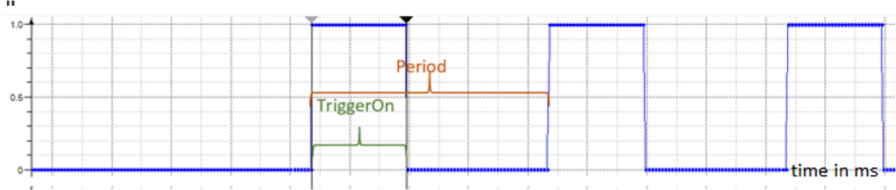
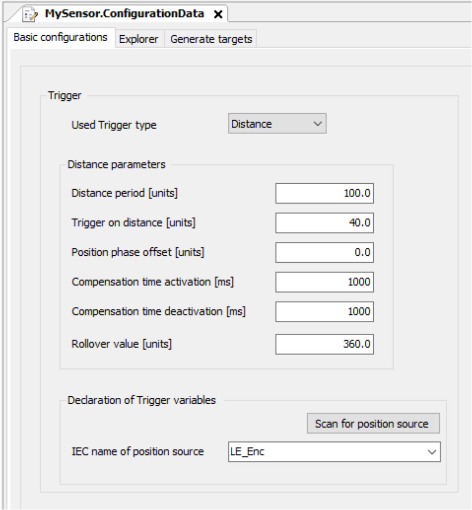
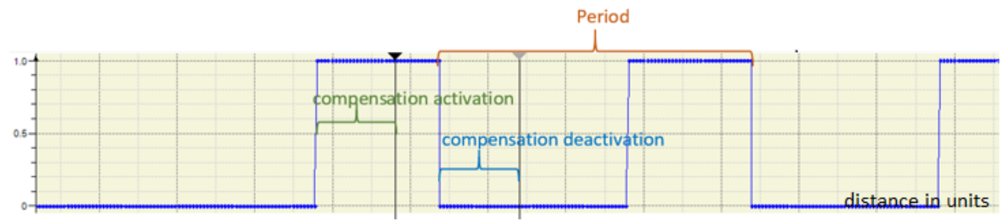
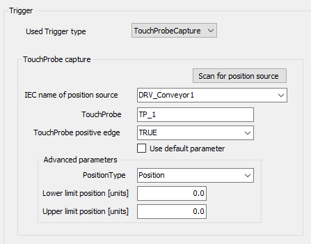

# Basic Configurations

## Overview

The tab Basic configurations allows you to configure the sensor trigger parameters. You need to configure the trigger type.

The following Trigger types are possible:

* External (default trigger type)
* Timer (time based)
* Distance (position based)
* TouchProbeCapture

You need to configure additional configuration parameters for the three trigger types. Depending on the selected Used Trigger type, the display changes.

## Trigger Type External

* Select the trigger type External

  if you need to create and process a defined trigger event.
* The trigger is responsible for the target generation procedure.

NOTE: When using the External trigger type, use the generated Trigger method (see [SR\_<MySensor> — Trigger (Method)](SR_MySensorTriggerMethod-673DE268.html#SR_MySensorTriggerMethod-673DE268)) and the corresponding xTrigger property (see [Properties](SR_MySensorGeneralInformation-66CE031B.html#SR_MySensorGeneralInformation-66CE031B__Properties-68E8D7DD)).

## Trigger Type Timer

When selecting the trigger type Timer, a trigger signal based on a timer is generated.

Timer parameters:

* Timer period: defines the period of time of the timer signal, in the example below 100 ms.
* Timer trigger on: defines the pulse width of the trigger signal, in the example below 40 ms.

The following diagram shows an example of the Timer Trigger signals:

## Trigger Type Distance

When selecting the Trigger type Distance, a trigger signal based on a changed position is generated.

Distance parameters:

* Distance period: defines the units of the distance period, here 100 units.
* Timer on distance: defines the units while the trigger remains active, here 40 units.
* Position phase offset: can be used to start from a position <> 0 unit.
* Compensation time activation: defines the time during activation.
* Compensation time deactivation: defines the time during deactivation.
* Rollover value: defines the unit value to handle a rollover in the position value.

The following diagram shows an example of the Distance Trigger signals:

## Trigger Type TouchProbeCapture

When selecting the trigger type TouchProbeCapture, a trigger signal XXX.

TouchProbe capture :

* IEC name of position source: Define the position of the position source (drive or logical encoder) which is stored when TouchProbe is triggered.
* TouchProbe: Define the TouchProbe which is used to trigger.
* TouchProbe positive edge: Is selected if a positive or negative edge of signal is used.

Advanced parameters :

* PositionType: Select what type of value of position source is stored.
* Lower limit position: Lower limit of a window, for example of position.
* Upper limit position: Upper limit of a window, for example of position.

NOTE: In case Use default parameter is selected, the default parameter for Lower limit is the minimum LREAL value (-3.402823466E+38) and for the Upper limit the maximum LREAL value (3.402823466E+38).

EIO0000004422.04