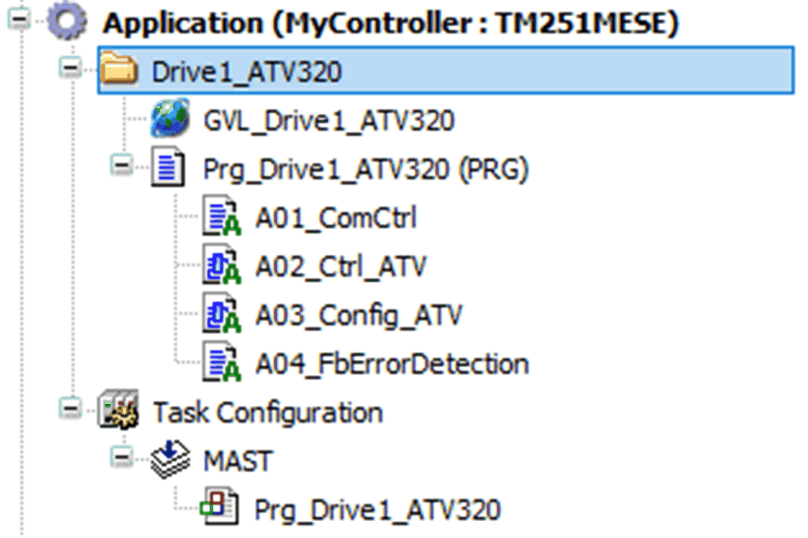
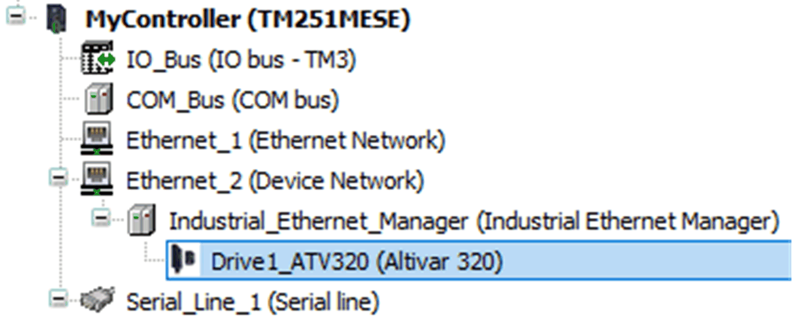

# Device Modules

## What are Device Modules

Device Modules are application code templates that provide a quick and efficient way to integrate field devices such as variable speed drives (VSD) or servo drives in the Logic Builder project. The Device Modules are implemented on function templates, a mechanism within Logic Builder to recall predefined application program contents.

Each Device Module contains the required application objects and the corresponding program code to control the field device to monitor its status, and to handle errors that are detected. It includes a separate global variable list to access the different device functionalities available to the entire Logic Builder project.

Device Modules are available for many field devices, either connected to the control system via fieldbus or hardwired. In addition, functional components that are directly associated to field devices are also contained within the Device Modules.

## How to Work with Device Modules

To add a Device Module, proceed as described in section [Adding a Function Template](FunctionTempl-8E5A71FF.html#FunctionTempl-8E5A71FF__AddingAFunctionTemplate-8E5EC517).

Each Device Module provides a set of application objects. For a clear separation within the project, all Device Module application content inserted appears grouped in the Application tree:



The Program (PRG) as part of a Device Module is added automatically to the task configuration of the project.

The variables (interface) of the Device Modules are declared in a global variable list (GVL). They are accessible in the project as described in the following example.

To access to the variable which indicates the communication state of the Altivar 320 with the assigned instance name `Drive1_ATV320`, you can write the following code:

```
IF NOT(GVL_Drive1_ATV320.xConnectionOkay)THEN
(*your program code*);
END_IF
```

Typically Device Modules include a field device. Such a field device is added under the associated fieldbus manager. This assumes that the respective fieldbus manager has been configured in the project before you can instantiate a Device Module. For example, the Device Module ATV320\_EtherNetIP requires a configured **EtherNetIP Scanner**.



EIO0000002835.04