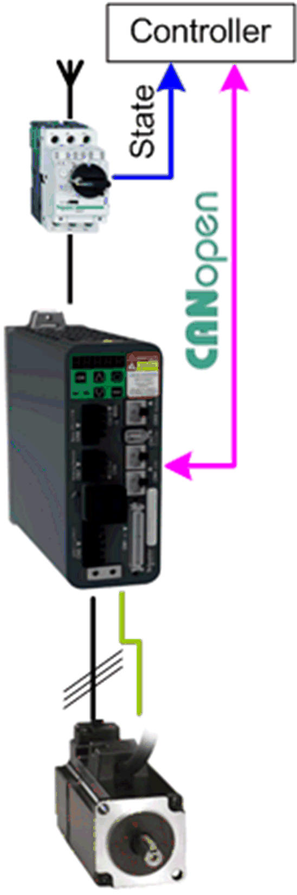

# Overview

## Graphical Representation

## Lexium\_28\_CANopen Device Module Description

The Device Module provides a ready-to-use coding template as a pattern to monitor and control a Lexium 28 servo drive via CANopen through a Schneider Electric controller.

The Device Module Lexium\_28\_CANopen is represented by a function template and consists of a Global Variable List (GVL), a program, and the device Lexium 28 under the CANopen manager. After instantiation of the Device Module, these objects are added to your project. They appear with the name which has been assigned using [**Add Function From Template**](../../../../../api/crossBook?lang=en-US&virtualBookName=SoMProg&topicID=D_SE_0083799).

The GVL provides the variables which are used to monitor and control the Lexium 28 via CANopen.

The program provides the following features:

* monitor the communication state of the device
* monitor the state of the device
* control the device in jog mode
* control the device in velocity mode
* control the device in relative positioning mode
* control the device in absolute positioning mode
* control the device in homing mode
* reset the drive in case of an error state

With the Lexium 28 as part of this Device Module, the second and the third transmit PDOs (Process Data Object) are activated to monitor the values for speed and position of the drive.

In addition, for the transmit PDOs the inhibit time is set to 10 ms and the event time is set to 100 ms. Therefore, there is a transmission between 10 ms (inhibit time) given data in the PDO has changed, and 100 ms (event time) given no data has changed.

NOTE: If you do not need this feature for your application, unselect the second and third transmit PDO (Process Data Object) on the tab PDO mapping in the device editor of the drive to optimize your data transmission rate.

## Compatibility

The described Device Module can be used in applications of the controller families supported by EcoStruxure Machine Expert and supporting the CANopen protocol.

EIO0000002835.04