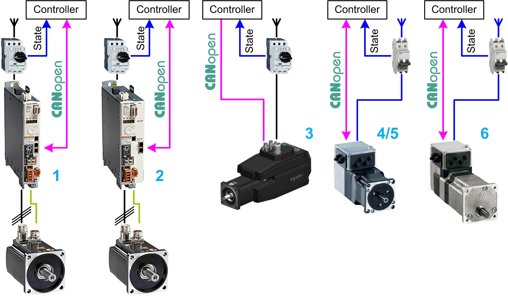

# Overview

## Graphical Representation

**1** Lexium\_32A\_CANopen\_GMC

**2** Lexium\_32M\_CANopen\_GMC

**3** Lexium\_32i\_CANopen\_GMC

**4** Lexium\_ILA1F\_CANopen\_GMC

**5** Lexium\_ILS1F\_CANopen\_GMC

**6** Lexium\_ILE1F\_CANopen\_GMC

## Device Module Description

Each Device Module covered by this description provides the application objects and the device which are required to monitor and control the associated Lexium drive type via CANopen with a Schneider Electric controller. Each device (Lexium) requires the CANopen manager under the CAN interface of the controller within the Devices tree of the Logic Builder configuration.

In contrast to the Device Modules Lexium\_•••\_CANopen, the Device Modules described in this chapter implement the new fieldbus-, and device-independent libraries for General Motion Control (GMC) and the associated devices.

## Compatibility

The described Device Module can be used in applications of the controller families supported by EcoStruxure Machine Expert and supporting the CANopen protocol.

EIO0000002835.04