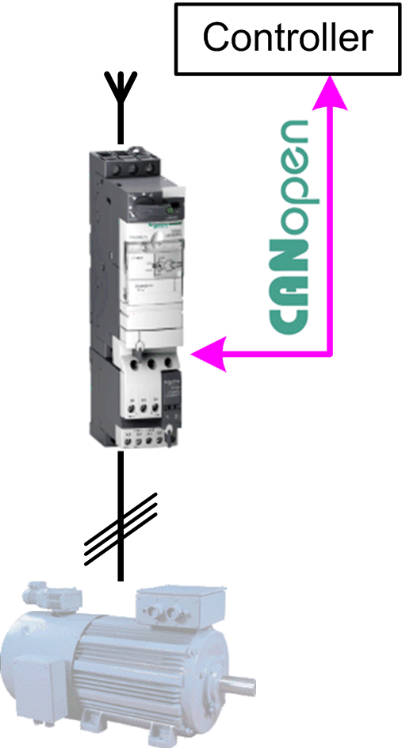

# Overview

## Graphical Representation

## TeSysU\_CANopen\_Standard Device Module Description

The Device Module provides a ready-to-use coding template as a pattern to monitor and control a TeSys U via CANopen through a Schneider Electric controller.

The Device Module TeSysU\_CANopen\_Standard is represented by a function template and consists of a global variable list GVL, a program, and the device TeSysU\_Sc\_St under the CANopen manager. After instantiation of the Device Module, these objects are added to your project. They appear with the name which has been assigned using [**Add Function From Template**](../../../../../api/crossBook?lang=en-US&virtualBookName=SoMProg&topicID=D_SE_0083799).

The GVL provides the variables which are used to monitor and control the TeSys U via CANopen.

The program provides the following features:

* monitor the communication state of the device
* monitor the state of the device
* control the device
* reset the drive in case of an error state

## Compatibility

The described Device Module can be used in applications of the controller families supported by EcoStruxure Machine Expert and supporting the CANopen protocol.

EIO0000002835.04