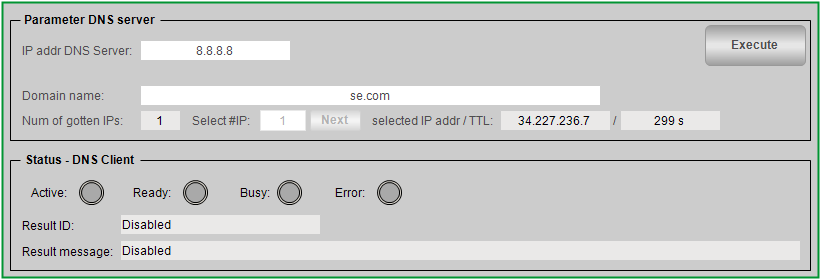

# Overview

## Graphical Representation

## Description

The function template DnsClient provides a ready-to-use coding template as a pattern to implement a DNS (Domain Name System) client in your application. It implements the following features:

* DNS client with the use of the TcpUdpCommunication library.
* Visualization to monitor and control the DNS client.

## Compatibility

The described function template can be used in applications of the controller families supported by EcoStruxure Machine Expert and supporting Ethernet communications.

EIO0000002835.04