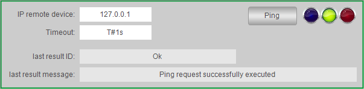

# Overview

## Graphical Representation

## Description

The function template PingClient provides a ready-to-use coding template as a pattern to implement a Ping client in your application. It implements the following features:

* Ping client with the use of the TcpUdpCommunication library.
* Visualization to monitor and control the Ping client.

## Compatibility

The described function template can be used in applications of the controller families supported by EcoStruxure Machine Expert and supporting Ethernet communications.

EIO0000002835.04