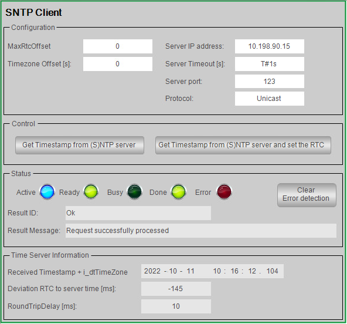

# Overview

## Graphical Representation

## Description

The function template SntpClient provides a ready-to-use coding template as a pattern to implement an SNTP (Simple Network Time Protocol) client in your application. It implements the following features:

* Get a timestamp from an (S)NTP server with the use of the function block FB\_SntpClient from the TimeSync library.
* Set the RTC (Real Time Clock) of a controller to the timestamp received.

## Compatibility

The described function template can be used in applications of the controller families supported by EcoStruxure Machine Expert and supporting Ethernet communications.

EIO0000002835.04