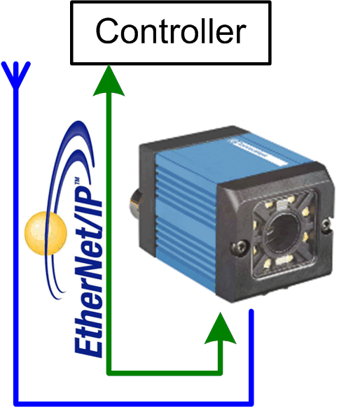

# Overview

## Graphical Representation

## OsiSense\_XUW\_EtherNetIP Device Module Description

The Device Module OsiSense\_XUW\_EtherNetIP provides the application objects and the device which are required to monitor and control an OsiSense XUW vision sensor via EtherNet/IP with a Schneider Electric controller. The device OsiSense XUW requires the **Industrial Ethernet manager** under the Ethernet interface of the controller.

## Compatibility

The described Device Module can be used in applications of the controller families supported by EcoStruxure Machine Expert and supporting the EtherNet/IP protocol.

EIO0000002835.04