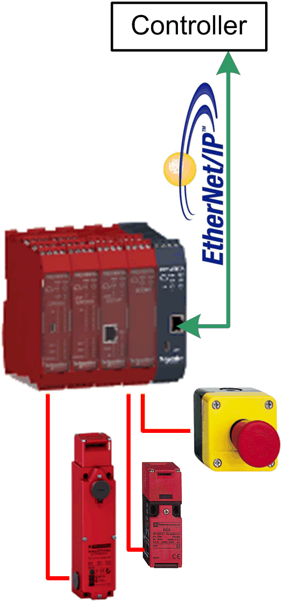

# Overview

## Graphical Representation

## Preventa\_XPSMCM\_EtherNetIP Device Module Description

The Device Module Preventa\_XPSMCM\_EtherNetIP provides the application objects and the device which are required for the non-safety-related data exchange with an XPSMCM Modular Safety Controller via EtherNet/IP with a Schneider Electric controller. The data which are exchanged between the safety controller (**T**arget) and the EcoStruxure Machine Expert controller (**O**riginator) comprise from the view of the originator:

* Inputs (**T->O**): status information about the safety-related inputs and outputs, 16 discrete signals which can be freely assigned in the SoSafe application on the safety controller to provide additional information to the non-safety-related application
* Outputs (**O->T**): 8 discrete signals to provide information from the non-safety-related application to the SoSafe application on the safety controller.

The XPSMCM requires the **Industrial Ethernet manager** under the Ethernet interface of the controller.

## Compatibility

The described Device Module can be used in applications of the controller families supported by EcoStruxure Machine Expert and supporting the EtherNet/IP protocol.

EIO0000002835.04